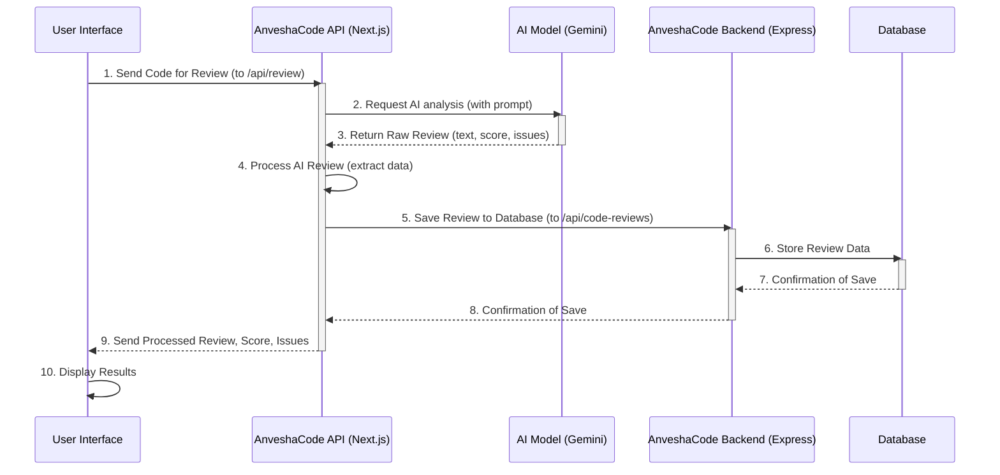

# Chapter 1: AI Code Review Core

Welcome to AnveshaCode! In this first chapter, we're going to explore the very heart of our platform: the **AI Code Review Core**. Think of it as the brain behind AnveshaCode, the part that actually "reads" and "understands" your code to give you helpful feedback.

### The Problem: Getting Good Code Feedback

Imagine you've just finished writing a piece of code. It works, but is it *good* code? Is it secure? Is it efficient? Does it follow best practices? Getting detailed, immediate feedback on your code is super valuable for learning and improving, but it's often hard to get. You might need to ask a senior developer, wait for a code review process, or manually search for common issues. This can be slow and sometimes intimidating!

### AnveshaCode's Solution: Your Automated Coding Tutor

AnveshaCode steps in as your super-smart, automated coding tutor. It's designed to read your work and give you detailed, actionable advice, just like a human expert would. The **AI Code Review Core** is what makes this magic happen.

Let's look at the central use case:

**Use Case: Reviewing a Single Code File**
A user wants to get feedback on a JavaScript file they've written. They upload the file to AnveshaCode, click a button, and seconds later, they receive a score, a list of issues, and a detailed explanation of how to improve their code.

### Key Concepts

To understand the AI Code Review Core, let's break down its main components:

1.  **User-Submitted Code**: This is your code! You can either paste it directly into our platform or upload one or more code files (even an entire folder!).
2.  **Large Language Model (LLM)**: This is the "brain" of our automated tutor. An LLM is a powerful AI that can understand and generate human-like text. In AnveshaCode, we use an LLM specifically trained to understand programming languages. It's like a super-smart student who has read millions of lines of code and can spot patterns and mistakes.
3.  **Analysis**: Once the LLM receives your code, it performs a deep analysis. It doesn't just check for simple typos; it looks for security flaws, performance bottlenecks, best practice violations, potential bugs, and how well the code is organized.
4.  **Structured Feedback**: After analysis, the LLM provides its findings. We then process this raw feedback into an easy-to-understand format:
    *   **A Score**: A number out of 100, telling you the overall quality of your code.
    *   **Issue Count**: How many problems the AI found.
    *   **Detailed Review**: A step-by-step explanation of each issue, often with suggested code changes.

### How to Use the AI Code Review Core

From a user's perspective, interacting with the AI Code Review Core is straightforward. You'll typically use the "New Code Review" page in AnveshaCode.

Here's how you'd submit code:

```typescript
// frontend/app/new-review/page.tsx (simplified)
import { useState } from "react"
import { Textarea } from "@/components/ui/textarea"
import { Button } from "@/components/ui/button"

export default function NewReviewPage() {
  const [pastedCode, setPastedCode] = useState("") // Holds code pasted by user
  const [reviewResult, setReviewResult] = useState<string | null>(null) // Stores AI's review
  const [reviewScore, setReviewScore] = useState<number | null>(null) // Stores AI's score
  const [issuesCount, setIssuesCount] = useState<number | null>(null) // Stores AI's issue count
  const [isLoading, setIsLoading] = useState(false) // To show "Analyzing..." state

  // Function to send code for review
  const handlePasteReview = async () => {
    if (!pastedCode.trim()) return; // Don't review empty code

    setIsLoading(true); // Show loading state
    try {
      // Calls the backend API to get a review
      const response = await fetch('/api/review', { /* ... request details ... */ });
      const data = await response.json();

      // Update states with review results
      setReviewResult(data.review);
      setReviewScore(data.score);
      setIssuesCount(data.issuesCount);
    } catch (error) {
      console.error("Review failed:", error);
    } finally {
      setIsLoading(false); // Hide loading state
    }
  };

  return (
    <div>
      <Textarea
        placeholder="Paste your code here..."
        value={pastedCode}
        onChange={(e) => setPastedCode(e.target.value)} // Update code as user types
      />
      <Button onClick={handlePasteReview} disabled={isLoading}>
        {isLoading ? "Analyzing..." : "Review Code"}
      </Button>

      {/* This component displays the results */}
      <ReviewResult />
    </div>
  );
}
```
This simplified code snippet shows how a user pastes code into a text area, and then a button click triggers the `handlePasteReview` function. This function sends the code to our backend for review.

Once the review is complete, the `ReviewResult` component (not fully shown here, but present in the actual application) will display the AI's feedback.

Here’s a high-level look at what you’ll see after submitting your code:

| Output Type         | Description                                                                 | Example                                            |
| :------------------ | :-------------------------------------------------------------------------- | :------------------------------------------------- |
| **Score**           | An overall quality rating out of 100.                                       | `Score: 85/100` (Good quality, some improvements)  |
| **Total Issues**    | A count of detected problems.                                               | `Total Issues Found: 3`                            |
| **Detailed Review** | Markdown-formatted feedback with explanations and suggested code changes.   | `## Security Issues` <br/> `- Problem: XSS vulnerability in ...` <br/> ````suggestion` `// Original` `// Suggested` ```` ` |

### Under the Hood: How the AI Code Review Core Works

Now, let's peek behind the curtain to see how AnveshaCode processes your code review request. It's like a mini-journey for your code!

Here’s a simple sequence of events:



Let's break down the key steps with code examples:

#### 1. Frontend Calls the AnveshaCode API (`/api/review`)

When you click "Review Code" (or "Review Code" after pasting), the frontend makes a call to our AnveshaCode API layer, specifically the `/api/review` endpoint.

```typescript
// frontend/app/new-review/page.tsx (simplified callReviewAPI function)
const callReviewAPI = async (code: string, fileName?: string) => {
  // We need a user token for security, discussed in Chapter 2
  const token = localStorage.getItem('token');

  const response = await fetch('/api/review', { // Making a request to our own API
    method: 'POST',
    headers: {
      'Content-Type': 'application/json',
      'Authorization': `Bearer ${token}` // Sends authentication token
    },
    body: JSON.stringify({ // Your code is sent in the body
      code,
      fileName
    }),
  });

  const data = await response.json();
  if (!response.ok) {
    throw new Error(data.error || 'Failed to get code review');
  }
  return data.review; // The AI's review content
};
```
This `callReviewAPI` function is responsible for sending your `code` and `fileName` to our AnveshaCode API, which acts as an intermediary.

#### 2. AnveshaCode API Calls the AI Model (Gemini)

The `/api/review` endpoint in our Next.js application receives your code. Its main job is to prepare a "prompt" (a set of instructions) for the LLM and then send your code to the LLM for analysis.

```typescript
// frontend/app/api/review/route.ts (simplified POST handler)
import { NextResponse } from "next/server";

const GEMINI_API_KEY = process.env.GEMINI_API_KEY; // Your secret key
const GEMINI_MODEL = "gemini-1.5-flash"; // The specific AI model we use

export async function POST(request: NextRequest) {
  const { code, fileName } = await request.json();

  // Create instructions for the AI model
  const prompt = `You are an expert code reviewer. Please review the following code:
\`\`\`
${code}
\`\`\`
Provide a score out of 100. Count total issues. Include security, performance, best practices.
Format: Score: X/100, Total Issues Found: Y, Language: [lang], then detailed review.
`;

  const response = await fetch(
    `https://generativelanguage.googleapis.com/v1beta/models/${GEMINI_MODEL}:generateContent?key=${GEMINI_API_KEY}`,
    {
      method: "POST",
      headers: { "Content-Type": "application/json" },
      body: JSON.stringify({ contents: [{ parts: [{ text: prompt }] }] }),
    }
  );

  const data = await response.json();
  const review = data.candidates?.[0]?.content?.parts?.[0]?.text; // Get the AI's review text

  // Extract score, issuesCount, language from the review text using regular expressions
  const scoreMatch = review.match(/Score:\s*(\d+)\/100/i);
  const issuesMatch = review.match(/Total Issues Found:\s*(\d+)/i);
  const languageMatch = review.match(/Language:\s*([^\n]+)/i);

  const score = scoreMatch ? parseInt(scoreMatch[1]) : null;
  const issuesCount = issuesMatch ? parseInt(issuesMatch[1]) : null;
  const language = languageMatch ? languageMatch[1].trim() : null;

  return NextResponse.json({ review, score, issuesCount, language });
}
```
This code block shows how the AnveshaCode API:
1.  Takes your code from the request.
2.  Builds a detailed `prompt` for the AI, asking it specific questions (score, issues, detailed review, language).
3.  Sends this prompt to the `GEMINI_MODEL` (our chosen LLM) using its API.
4.  Receives the AI's response, which is a block of text.
5.  **Parses** this text to extract specific pieces of information like the `score`, `issuesCount`, and `language` using simple pattern matching.
6.  Sends these extracted pieces, along with the full `review` text, back to your frontend.

#### 3. Saving the Review to the Database

After the frontend receives the AI's review, it doesn't just display it. It also makes another API call to save this valuable review data to our database. This ensures you can always go back and see your past reviews.

```typescript
// frontend/app/new-review/page.tsx (simplified saving part of handleReview)
const handleReview = async () => {
  // ... (previous code to get review from AI) ...

  try {
    const review = await callReviewAPI(fileToReview.content, fileToReview.name); // Get review from AI
    setReviewResult(review); // Display review

    // Now, save this review to the database
    const token = localStorage.getItem('token');
    const saveResponse = await fetch('/api/code-reviews', { // Call to save API
      method: 'POST',
      headers: {
        'Content-Type': 'application/json',
        'Authorization': `Bearer ${token}`
      },
      body: JSON.stringify({
        fileName: fileToReview.name,
        code: fileToReview.content,
        review: review, // The AI's full review
        score: reviewScore, // The extracted score
        issuesCount: issuesCount, // The extracted issue count
        language: language // The detected language
      }),
    });

    if (!saveResponse.ok) {
      console.error('Failed to save review to database');
    }
  } catch (error) {
    // ... error handling ...
  } finally {
    // ... loading state handling ...
  }
};
```
This part shows how the frontend makes a `POST` request to the `/api/code-reviews` endpoint, sending all the review details.

This `/api/code-reviews` endpoint, also part of our Next.js API, then communicates with our dedicated backend service (AnveshaCode Backend) to perform the actual database operation.

```typescript
// frontend/app/api/code-reviews/route.ts (simplified POST handler)
import { NextResponse } from 'next/server';
import { CodeReviewService } from '@/services/codeReview.service'; // Our backend service

export async function POST(request: NextRequest) {
  // Get user's ID from session (covered in Chapter 2)
  const session = await getServerSession(authOptions);
  if (!session?.user?.id) {
    return NextResponse.json({ error: 'Unauthorized' }, { status: 401 });
  }

  const data = await request.json(); // Review data from frontend

  // Call the backend service to create the review in the database
  const review = await CodeReviewService.createReview(data, session.user.id);

  return NextResponse.json(review);
}
```
Finally, the `CodeReviewService` in our backend uses a tool called Prisma (which you'll learn about in [Chapter 3: Database Management with Prisma](03_database_management_with_prisma_.md)) to save the review to the database.

```typescript
// backend/src/services/codeReview.service.ts (simplified createReview method)
import { PrismaClient } from '@prisma/client';
import { canCreateReview } from '../utils/subscription'; // Checks subscription limits

const prisma = new PrismaClient(); // Connects to the database

export class CodeReviewService {
  static async createReview(data: CreateCodeReviewDto, userId: string) {
    // Check if user has review limits (explained in Chapter 5)
    // if (!canCreateReview(...)) { throw new Error('Limit reached'); }

    return prisma.codeReview.create({ // Command to save to the database
      data: {
        userId,
        fileName: data.fileName,
        code: data.code,
        review: data.review,
        score: data.score,
        issuesCount: data.issuesCount,
        language: data.language,
        status: 'COMPLETED' // Mark as completed
      }
    });
  }
}
```
This final step ensures your code review is permanently stored and linked to your account. We also have checks here for [Subscription & Review Limits](05_subscription___review_limits_.md), which prevent users from exceeding their plan's review allowance.

### Conclusion

In this chapter, we learned that the **AI Code Review Core** is the engine of AnveshaCode. It takes your code, uses a powerful AI model (LLM) to analyze it, and then provides structured, actionable feedback including a score, issue count, and detailed review. We saw how the frontend initiates the process, how our API layer communicates with the AI model, and how the results are finally stored in the database.

While we touched upon user authentication and database interactions, these topics are important core abstractions themselves. In the next chapter, we'll dive into how AnveshaCode knows who you are and keeps your data secure.

[Next Chapter: User Authentication & Authorization](02_user_authentication___authorization_.md)

---