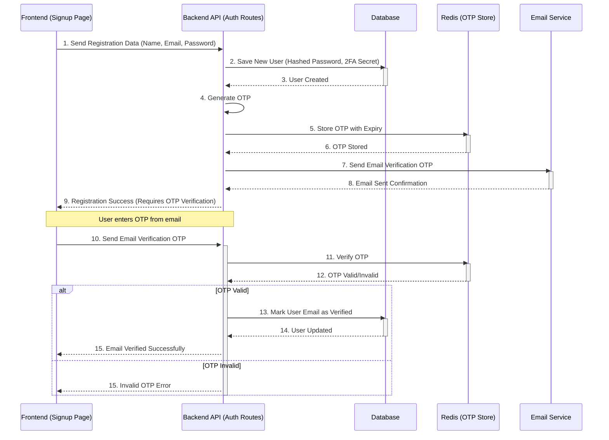
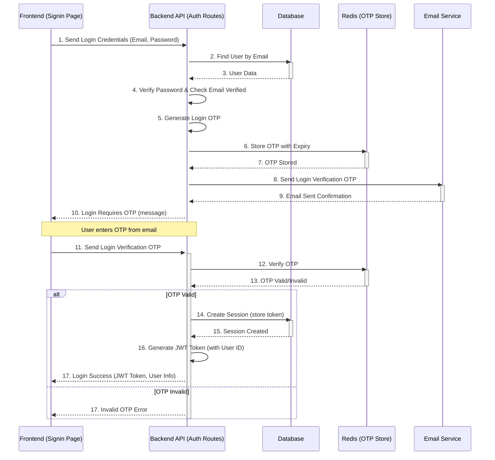

# Chapter 2: User Authentication & Authorization

Welcome back to AnveshaCode! In our [first chapter: AI Code Review Core](01_ai_code_review_core_.md), we learned how AnveshaCode acts as your super-smart coding tutor, analyzing your code with AI. But for AnveshaCode to work for *you*, it needs to know who you are! Imagine a library where anyone can take out books without a library card – chaos!

### The Problem: Knowing Who You Are

Just like a library needs to know its members, AnveshaCode needs to know its users. Why?
*   **Personalization:** To show *your* past code reviews, not someone else's.
*   **Security:** To protect your data and prevent unauthorized access.
*   **Features:** To apply limits on features (like how many code reviews you get) based on your subscription plan.
*   **Communication:** To send you important emails (like password reset links or OTPs).

This is where **User Authentication & Authorization** comes in. It's the system that handles everything related to user access. Think of it as the bouncer and ID checker for the entire application, making sure the right people get in and stay secure.

Let's look at a central use case:

**Use Case: Signing Up and Logging In**
A new user wants to try AnveshaCode. They create an account (signup), verify their email, and then log in using their password. Once logged in, they can access their personal dashboard and use the code review feature.

### Key Concepts

User Authentication and Authorization might sound complicated, but let's break it down into simple pieces:

1.  **Authentication (Who are you?):** This is the process of *proving* who you say you are.
    *   **Signup:** Creating a new account with your name, email, and password.
    *   **Login:** Entering your email and password (or using Google) to access your account.
    *   **Email Verification:** A step where you prove you own the email address you signed up with, usually by entering a special code (OTP).
    *   **Password Reset:** What happens if you forget your password and need to set a new one.

2.  **Authorization (What can you do?):** Once we know *who* you are (authenticated), this is about deciding *what* you're allowed to do. For example, only *your* account can see *your* code reviews. This also relates to [Chapter 5: Subscription & Review Limits](05_subscription___review_limits_.md) where different plans allow different numbers of reviews.

3.  **Tokens (Your Digital ID):** After you successfully log in, AnveshaCode gives you a special "digital ID card" called a **JSON Web Token (JWT)**. Instead of asking for your password every time you click a button, your browser just shows this token. The system quickly checks if the token is valid and then knows it's you.

4.  **Sessions:** When you log in, we also create a "session" which basically means, "This user is currently active." The token helps manage this session. If you log out, your session ends.

5.  **OTP (One-Time Password) / 2FA (Two-Factor Authentication):** This is an extra layer of security. Sometimes, after you enter your password, AnveshaCode sends a unique, short-lived code to your email. You need to enter this code to complete the login, making it much harder for someone else to access your account even if they know your password.

### How to Use User Authentication & Authorization

From a user's perspective, you'll interact with this system on pages like "Sign up", "Sign in", and "Forgot Password". Behind the scenes, AnveshaCode ensures that when you send your code for review (as seen in Chapter 1), it knows it's coming from *your* account.

Let's look at some simplified frontend code snippets:

#### 1. Signing Up (`/signup` page)

When you visit the signup page, you'll see a form. After you fill it out and click "Sign up", the `handleSubmit` function sends your details to our backend.

```typescript
// frontend/app/signup/page.tsx (simplified)
import { authApi } from "@/lib/auth"; // Our API helper

export default function RegisterPage() {
  const [formData, setFormData] = useState({ /* ... fields ... */ });
  const [showOtpVerification, setShowOtpVerification] = useState(false);
  const [isLoading, setIsLoading] = useState(false);

  const handleSubmit = async (e: React.FormEvent) => {
    e.preventDefault();
    setIsLoading(true);
    try {
      const response = await authApi.register(formData); // Call our auth API
      if (response.userId) {
        setShowOtpVerification(true); // If successful, show OTP step
        // A toast notification will appear here
      } else {
        // Handle registration failure
      }
    } catch (error) { /* ... error handling ... */ }
    finally { setIsLoading(false); }
  };

  // ... rest of the component (form, OTP input) ...
}
```
This code calls `authApi.register`, which is a helper function that sends your signup details to our backend. If successful, it moves to the OTP verification step.

#### 2. Email Verification

After signup, an OTP is sent to your email. You enter this code on the same signup page, and it's sent to the backend for verification.

```typescript
// frontend/app/signup/page.tsx (simplified handleOtpSubmit)
const handleOtpSubmit = async (e: React.FormEvent) => {
  e.preventDefault();
  setIsLoading(true);
  try {
    const response = await authApi.verifyEmail(otpData); // Verify email with OTP
    if (response.message === "Email verified successfully") {
      router.push('/signin'); // Redirect to login page
      // A toast notification will appear here
    } else {
      // Handle invalid OTP
    }
  } catch (error) { /* ... error handling ... */ }
  finally { setIsLoading(false); }
};
```
This function verifies the OTP you entered. If correct, your email is marked as verified, and you can now log in.

#### 3. Logging In (`/signin` page)

When you log in, your credentials are sent to the backend. Sometimes, an additional OTP step is required for extra security.

```typescript
// frontend/app/signin/page.tsx (simplified handleSubmit)
import { useAuth } from "@/lib/auth-context"; // Our authentication context

export default function LoginPage() {
  const { login } = useAuth(); // Get the login function from our auth context
  const [formData, setFormData] = useState({ email: "", password: "" });
  const [showOtpVerification, setShowOtpVerification] = useState(false);
  const [isLoading, setIsLoading] = useState(false);

  const handleSubmit = async (e: React.FormEvent) => {
    e.preventDefault();
    setIsLoading(true);
    try {
      const response = await authApi.login(formData); // Attempt to log in
      if (response.requiresOTP) {
        setShowOtpVerification(true); // If 2FA is on, show OTP input
      } else if (response.token) {
        await login(response.token); // If successful, store token & update user state
        router.push('/dashboard'); // Go to dashboard
      } else {
        // Handle login failure
      }
    } catch (error) { /* ... error handling ... */ }
    finally { setIsLoading(false); }
  };
  // ... rest of the component ...
}
```
Here, after a successful login (and possibly OTP verification via `handleOtpSubmit`), the `login(response.token)` function from our `AuthContext` is called. This function stores the JWT token and updates the application's user state.

#### 4. Logging in with Google

AnveshaCode also supports logging in with your Google account for convenience.

```typescript
// frontend/components/google-auth-button.tsx (simplified)
import { Button } from "@/components/ui/button";

export function GoogleAuthButton() {
  const [isLoading, setIsLoading] = useState(false);

  const handleGoogleAuth = async () => {
    setIsLoading(true);
    try {
      // Get the Google OAuth URL from our backend
      const response = await fetch(`${process.env.NEXT_PUBLIC_API_URL}/auth/google`);
      const data = await response.json();
      if (data.authUrl) {
        window.location.href = data.authUrl; // Redirect to Google for login
      }
    } catch (error) { /* ... error handling ... */ }
    finally { setIsLoading(false); }
  };

  return (
    <Button onClick={handleGoogleAuth} disabled={isLoading}>
      {/* ... Google icon and text ... */}
    </Button>
  );
}
```
Clicking the "Google" button sends you to Google's login page. After you successfully log in there, Google sends you back to AnveshaCode with a special code. Our backend then exchanges this code for your user information and logs you in.

#### 5. Protecting Routes (Authorization in action)

Once you're logged in, certain parts of the application (like your dashboard or code review page) should only be accessible to *you*. This is handled by a `ProtectedRoute` component.

```typescript
// frontend/components/ProtectedRoute.tsx (simplified)
'use client';

import { useAuth } from '@/lib/auth-context';
import { useRouter } from 'next/navigation';
import { useEffect } from 'react';

export default function ProtectedRoute({ children }: { children: React.ReactNode }) {
  const { user, isLoading } = useAuth(); // Get user state and loading status
  const router = useRouter();

  useEffect(() => {
    // If not loading and no user is logged in, redirect to signin
    if (!isLoading && !user) {
      toast.error('Please login to access this feature');
      router.push('/signin');
    }
  }, [user, isLoading, router]);

  if (isLoading) {
    return <div className="text-center">Loading user data...</div>;
  }

  if (!user) {
    return null; // Don't render content if not logged in
  }

  return <>{children}</>; // Render content if user is logged in
}
```
This `ProtectedRoute` wraps components that require a logged-in user. If `isLoading` is false and `user` is null (meaning no one is logged in), it redirects to the `/signin` page. This is a simple form of authorization.

### Under the Hood: How User Authentication & Authorization Works

Let's peek behind the curtain to see how AnveshaCode handles user accounts and access.

#### 1. The Journey of a New User (Signup & Email Verification)



#### 2. The Journey of a Logging-in User (Login & 2FA)



#### Code Deep Dive:

Let's look at how some of these backend processes are implemented.

**A. User Registration and OTP Handling**

When you register, your password is never stored directly. It's "hashed" using a process called `bcrypt` which turns it into a scrambled, irreversible string. An `OTP` is generated and saved in `Redis` (a super-fast temporary storage) with an expiry.

```typescript
// backend/src/auth/controller/auth-controller.ts (simplified register)
import bcrypt from 'bcrypt';
import crypto from 'crypto'; // For 2FA secret
import { createUser } from '../db/user';
import { generateOTP, storeOTP } from '../utils/otp';
import { sendVerificationEmail } from '../utils/email';

export const register = async (req: Request, res: Response) => {
  const { firstName, email, password } = req.body;
  const salt = await bcrypt.genSalt(10);
  const hashedPassword = await bcrypt.hash(password, salt);
  const twoFactorSecret = crypto.randomBytes(32).toString('hex'); // For future 2FA

  const user = await createUser({
    firstName, email, password: hashedPassword, twoFactorSecret
  });

  const otp = await generateOTP(email);
  await storeOTP(email, otp); // Store OTP in Redis
  await sendVerificationEmail(email, otp, firstName); // Send email

  res.status(201).json({ message: 'User registered', userId: user.id });
};
```
This function handles new user signups. It hashes the password for security, generates a secret for 2FA, creates the user in the database, and then sends an email verification OTP.

**B. Login and Session Management**

During login, your provided password is again hashed and compared to the stored hash. If they match, a new OTP is generated for 2FA. Once that OTP is verified, a JWT token is created and stored as a "session" in the database.

```typescript
// backend/src/auth/controller/auth-controller.ts (simplified login and verifyLoginOTP)
import { findUserByEmail } from '../db/user';
import { generateToken } from '../utils/jwt'; // For creating digital ID
import { verifyOTP } from '../utils/otp'; // For checking OTP
import { PrismaClient } from '@prisma/client'; // For database interactions

const prisma = new PrismaClient();

export const login = async (req: Request, res: Response) => {
  const { email, password } = req.body;
  const user = await findUserByEmail(email);
  // ... password validation, email verification check ...

  const otp = await generateOTP(email);
  await storeOTP(email, otp);
  await sendVerificationEmail(email, otp, user.firstName, true); // True for login OTP
  res.status(200).json({ requiresOTP: true });
};

export const verifyLoginOTP = async (req: Request, res: Response) => {
  const { email, otp } = req.body;
  const user = await prisma.user.findUnique({ where: { email } });

  const isValid = await verifyOTP(email, otp);
  if (!isValid) {
    return res.status(400).json({ message: 'Invalid or expired OTP' });
  }

  const token = generateToken({ id: user.id, email: user.email }); // Create JWT token
  await prisma.session.create({ // Save session to database
    data: { sessionToken: token, userId: user.id, expires: new Date(Date.now() + 30 * 24 * 60 * 60 * 1000) }
  });
  res.status(200).json({ message: 'Login successful', token, user });
};
```
These functions demonstrate how AnveshaCode handles password-based login, sends a two-factor authentication (2FA) OTP, verifies it, and then generates a JWT token along with a session entry in the database.

**C. JWT Token Generation and Verification**

The `generateToken` function creates your unique digital ID. The `verifyToken` function is used by our backend to quickly check if that ID is valid whenever you make a request.

```typescript
// backend/src/auth/utils/jwt.ts (simplified)
import jwt from 'jsonwebtoken';

const JWT_SECRET = process.env.JWT_SECRET || 'your_super_secret_key';
const JWT_EXPIRES_IN = '30d'; // Token valid for 30 days

export const generateToken = (payload: Record<string, any>): string => {
  // Signs your user information (payload) with a secret key
  return jwt.sign(payload, JWT_SECRET, { expiresIn: JWT_EXPIRES_IN });
};

export const verifyToken = (token: string): any | null => {
  try {
    // Checks if the token is valid and hasn't expired
    return jwt.verify(token, JWT_SECRET);
  } catch (error) {
    return null; // Token is invalid or expired
  }
};
```
These utility functions are the core of how AnveshaCode creates and validates your "digital ID".

**D. The Authentication Middleware (The Bouncer)**

Every time you try to access a protected feature (like getting your code review history), our backend uses an `authenticate` middleware. This middleware is like a bouncer at a club: it checks your ID (the JWT token) to make sure you're allowed in.

```typescript
// backend/src/auth/middleware/auth.middleware.ts (simplified)
import { Request, Response, NextFunction } from 'express';
import { verifyToken } from '../utils/jwt';
import { PrismaClient } from '@prisma/client';

const prisma = new PrismaClient();

export const authenticate = async (req: Request, res: Response, next: NextFunction) => {
  const authHeader = req.headers.authorization;
  if (!authHeader || !authHeader.startsWith('Bearer ')) {
    return res.status(401).json({ message: 'Authentication required' });
  }

  const token = authHeader.split(' ')[1];
  const decoded = verifyToken(token); // Verify the JWT token
  if (!decoded) {
    return res.status(401).json({ message: 'Invalid or expired token' });
  }

  // Check if session exists in DB (logout or explicit expiry)
  const session = await prisma.session.findFirst({
    where: { sessionToken: token, userId: decoded.id, expires: { gt: new Date() } },
  });
  if (!session) {
    return res.status(401).json({ message: 'Session expired or invalid' });
  }

  req.user = { id: decoded.id, email: decoded.email }; // Attach user info to request
  next(); // Allow request to proceed
};
```
This `authenticate` function runs before any "protected" backend function. If the token is valid and the session is active, it adds your `user` ID and email to the request, so later parts of the application know exactly who is performing the action. This is how the `CodeReviewService` from Chapter 1 knows which `userId` to link the review to.

### Conclusion

In this chapter, we've explored the essential concepts of **User Authentication & Authorization**. We learned that AnveshaCode uses authentication to verify your identity through signup, login (including 2FA and Google login), and email verification. Once authenticated, authorization determines what you're allowed to do. We also saw how JWTs act as your digital ID, and how our backend uses an authentication middleware to secure your data and features. This system is crucial for a personalized and secure experience in AnveshaCode.

In the next chapter, we'll dive deeper into how AnveshaCode stores all this information, including user data and code reviews, using **Prisma**.

[Next Chapter: Database Management with Prisma](03_database_management_with_prisma_.md)

---
