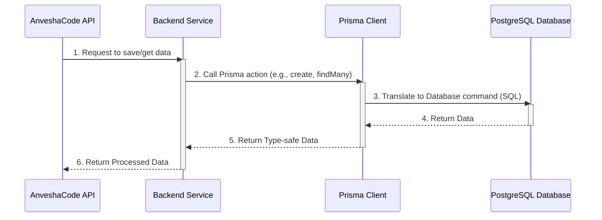

# Chapter 3: Database Management with Prisma

Welcome back to AnveshaCode! In our last chapter, [User Authentication & Authorization](02_user_authentication___authorization_.md), we learned how AnveshaCode knows who you are and keeps your account secure. We saw how users sign up, log in, and how their digital IDs (tokens) protect their access.

But where does all this important information actually *live*? Where are your user profiles stored? And what about all those valuable code reviews from [Chapter 1: AI Code Review Core](01_ai_code_review_core_.md)? This is where **Database Management** comes in.

### The Problem: Where to Store Everything?

Imagine AnveshaCode as a busy office.
*   Every user signs up, logs in, and updates their profile.
*   Every time you submit code, it gets reviewed, scored, and detailed feedback is generated.
*   Your subscription details (from the upcoming Payment chapter) need to be tracked.

If we just stored this data in temporary computer memory, it would disappear the moment the computer turns off! We need a safe, organized, and permanent place to keep all this information, and be able to find it quickly when needed. This safe place is called a **database**.

### AnveshaCode's Solution: PostgreSQL and Prisma – Your Smart Filing System

AnveshaCode uses a powerful database called **PostgreSQL** (often pronounced "Post-gress-Q-L"). Think of PostgreSQL as a giant, super-organized filing cabinet. It's excellent at storing lots of different types of information and finding it super fast.

However, talking directly to a database can be a bit like speaking a different language (SQL). This is where **Prisma** steps in! Prisma acts as a **bridge** or a **librarian**. It allows our application, written in TypeScript, to talk to the PostgreSQL database using simple, clear TypeScript code, instead of complex database commands. It's like having a well-organized library where Prisma is the librarian, making sure every piece of information is stored correctly and easy to find.

Let's look at a central use case:

**Use Case: Storing and Retrieving Code Reviews**
After a user submits their code and the AI reviews it, AnveshaCode needs to save this review (the original code, the AI's feedback, the score, etc.) permanently. Later, the user should be able to see a list of all their past reviews and view any specific review in detail.

### Key Concepts

Let's break down how Prisma helps manage our data:

1.  **Database (PostgreSQL):** This is the actual storage place. It holds our data in structured tables, similar to spreadsheets with rows and columns. For AnveshaCode, this includes tables for `User`, `CodeReview`, `Subscription`, and more.

2.  **Prisma Schema (`schema.prisma`):** This is the **blueprint** for our entire database. It's a special file where we describe what kind of data we want to store (our "models") and how they relate to each other. For example, we define that a `User` has an `email`, a `password`, and can have many `CodeReview`s. It's like designing the drawers and labels for our filing cabinet *before* we put anything in.

    Here's a simplified look at parts of AnveshaCode's Prisma Schema:

    ```prisma
    // backend/prisma/schema.prisma (simplified)
    model User {
      id            String    @id @default(cuid())
      firstName     String
      email         String    @unique
      password      String
      codeReviews   CodeReview[] // A user can have many code reviews
      subscription  Subscription? // A user can have one subscription
      // ... other user fields
    }

    model CodeReview {
      id            String    @id @default(cuid())
      userId        String    // Connects this review to a user
      fileName      String?
      code          String    @db.Text
      review        String    @db.Text
      score         Int
      user          User      @relation(fields: [userId], references: [id])
      // ... other review fields
    }

    // ... other models like Subscription, Session, Account
    ```
    In this schema, `model User` defines what information each user will have (like an ID, name, email, password). `model CodeReview` defines what information each code review will have. Notice how `userId` in `CodeReview` connects it back to a `User` using the `@relation` keyword – this means each review belongs to a specific user.

3.  **Prisma Client:** Once we have our blueprint (the schema), Prisma generates a special piece of code called the **Prisma Client**. This is the actual tool (our "librarian's assistant") that our TypeScript code uses to interact with the database. It lets us `create`, `read`, `update`, and `delete` data very easily and safely.

    ```typescript
    // Example: Connecting to the database with Prisma Client
    import { PrismaClient } from '@prisma/client';

    const prisma = new PrismaClient(); // This creates our Prisma Client!

    // Now 'prisma' can be used to talk to the database
    // For example: prisma.user.findUnique(...) or prisma.codeReview.create(...)
    ```
    You create one `PrismaClient` instance, and then use it throughout your application to perform database operations.

4.  **Migrations:** What happens if we decide to add a new field to our `User` model in the schema (e.g., `phone` number)? We need to tell our *actual* PostgreSQL database about this change. **Prisma Migrations** handle this for us. They create special files that contain instructions to update the database schema without losing any existing data. It's like hiring a skilled carpenter to modify our filing cabinet so it has new sections, without throwing away all our old files.

### How AnveshaCode Uses Prisma

Let's see how AnveshaCode uses Prisma to store and retrieve user data and code reviews.

#### 1. Creating a New User (from [Chapter 2](02_user_authentication___authorization_.md))

When a user registers, their information needs to be saved. Our `auth/db/user.ts` file handles this using Prisma Client's `create` command:

```typescript
// backend/src/auth/db/user.ts (simplified createUser)
import { PrismaClient, User } from '@prisma/client';

const prisma = new PrismaClient(); // Our Prisma Client instance

export const createUser = async (userData: any): Promise<User> => {
  // prisma.user refers to the 'User' model in our schema
  return prisma.user.create({
    data: {
      firstName: userData.firstName,
      email: userData.email,
      password: userData.password, // This is a hashed password!
      // ... other user data
    },
  });
};
```
This simple code takes user data and tells `prisma.user` to `create` a new entry in the `User` table of our database.

#### 2. Saving a Code Review (from [Chapter 1](01_ai_code_review_core_.md))

After the AI generates a code review, AnveshaCode saves it using the `createReview` method in `CodeReviewService`:

```typescript
// backend/src/services/codeReview.service.ts (simplified createReview)
import { PrismaClient } from '@prisma/client';

const prisma = new PrismaClient(); // Our Prisma Client instance

export class CodeReviewService {
  static async createReview(data: any, userId: string) {
    // Check user limits (covered in Chapter 5)
    // if (!canCreateReview(...)) { ... }

    // prisma.codeReview refers to the 'CodeReview' model
    return prisma.codeReview.create({
      data: {
        userId,       // Links the review to the user
        fileName: data.fileName,
        code: data.code,
        review: data.review,
        score: data.score,
        issuesCount: data.issuesCount,
        // ... other review details
        status: 'COMPLETED'
      }
    });
  }
}
```
Here, `prisma.codeReview.create` is used to add a new code review entry to the database, along with important details like the user who requested it (`userId`), the code, the review text, and the score.

#### 3. Getting a User's Past Reviews

To show a user their review history, we need to *read* data from the database. The `getUserReviews` method uses Prisma Client's `findMany` command:

```typescript
// backend/src/services/codeReview.service.ts (simplified getUserReviews)
import { PrismaClient } from '@prisma/client';

const prisma = new PrismaClient(); // Our Prisma Client instance

export class CodeReviewService {
  static async getUserReviews(userId: string) {
    // Find many code reviews where the userId matches
    return prisma.codeReview.findMany({
      where: {
        userId // Only get reviews for this specific user
      },
      orderBy: {
        createdAt: 'desc' // Sort by newest first
      },
      select: { // Only select these specific fields to return
        id: true,
        fileName: true,
        score: true,
        issuesCount: true,
        createdAt: true,
        // ... other fields
      }
    });
  }
}
```
This function retrieves all code reviews for a specific user, orders them, and only fetches the necessary fields to display in a list.

### Under the Hood: How Prisma Connects It All

Let's see the simplified flow of how AnveshaCode's backend interacts with Prisma and the database.



Here's a closer look at the key parts:

#### 1. Defining Your Database Blueprint (`prisma/schema.prisma`)

Before writing any code that uses Prisma, you first define your database's structure in `backend/prisma/schema.prisma`. This is the single source of truth for your data models.

```prisma
// backend/prisma/schema.prisma
// This is your Prisma schema file,
// learn more about it in the docs: https://pris.ly/d/prisma-schema

generator client {
  provider = "prisma-client-js"
}

datasource db {
  provider = "postgresql" // We are using PostgreSQL
  url      = env("DATABASE_URL") // Connection details from environment variables
}

model User {
  id                String    @id @default(cuid()) // Unique ID for each user
  firstName         String
  lastName          String?   // The '?' means this field is optional
  email             String    @unique // Email must be unique for each user
  password          String    // Stores the hashed password
  createdAt         DateTime  @default(now()) // Automatically sets current time
  updatedAt         DateTime  @updatedAt     // Automatically updates on changes
  emailVerified     DateTime?
  twoFactorSecret   String?
  codeReviews       CodeReview[] // Relation: A user can have many code reviews
  subscription      Subscription? // Relation: A user can have one subscription
  sessions          Session[] // For user sessions
  accounts          Account[] // For social logins like Google
}

model CodeReview {
  id            String    @id @default(cuid())
  userId        String    // The ID of the user who owns this review
  fileName      String?
  code          String    @db.Text // @db.Text allows storing very long text
  review        String    @db.Text
  score         Int
  issuesCount   Int
  language      String?
  status        ReviewStatus @default(COMPLETED)
  createdAt     DateTime  @default(now())
  updatedAt     DateTime  @updatedAt
  user          User      @relation(fields: [userId], references: [id]) // Connects to the User model

  @@index([userId]) // Helps database find reviews by user faster
}

// And other models like Subscription, Session, Account etc.
```
This schema is not just a definition; it's what Prisma uses to generate the Prisma Client and to understand how to create and manage your database tables.

#### 2. Initializing Prisma Client

You'll see `const prisma = new PrismaClient();` at the top of many service files (like `codeReview.service.ts` and `auth/db/user.ts`). This is the gateway to your database.

```typescript
// backend/src/services/codeReview.service.ts (start of file)
import { PrismaClient } from '@prisma/client'; // Import the Prisma Client

const prisma = new PrismaClient(); // Create one instance of the client
// This 'prisma' object is now ready to talk to your database!
```
By creating an instance of `PrismaClient`, you get access to all the methods that allow you to interact with your database models.

#### 3. Performing Database Operations with the Client

Now, with `prisma` available, you can perform database operations.

**A. Creating Data:**

```typescript
// From backend/src/auth/db/user.ts
export const createUser = async (userData: any) => {
  return prisma.user.create({ // 'user' refers to the User model
    data: { // 'data' is the information we want to save
      firstName: userData.firstName,
      email: userData.email,
      password: userData.password,
      // ... more fields
    },
  });
};
```
This line `prisma.user.create(...)` translates directly into an `INSERT` command in PostgreSQL, adding a new row to the `User` table.

**B. Reading Data:**

```typescript
// From backend/src/auth/db/user.ts
export const findUserByEmail = async (email: string) => {
  return prisma.user.findUnique({ // 'findUnique' finds one record by a unique field
    where: { email }, // 'where' specifies the condition for finding
  });
};
```
This `prisma.user.findUnique(...)` translates to a `SELECT * FROM "User" WHERE email = ...` command in PostgreSQL.

```typescript
// From backend/src/services/codeReview.service.ts
export class CodeReviewService {
  static async getUserReviews(userId: string) {
    return prisma.codeReview.findMany({ // 'findMany' finds multiple records
      where: { userId }, // Find all reviews for this userId
      orderBy: { createdAt: 'desc' }, // Order them
      select: { // Choose which columns to fetch
        id: true,
        fileName: true,
        score: true,
        // ...
      }
    });
  }
}
```
Similarly, `prisma.codeReview.findMany(...)` becomes a more complex `SELECT` query in PostgreSQL, filtering and ordering the results as specified.

#### 4. Keeping Your Database and Schema in Sync (Migrations)

Whenever you change your `schema.prisma` file (e.g., add a new field to a model), you run a Prisma command:

```bash
npx prisma migrate dev --name <your-migration-name>
```
This command does a few things:
*   It compares your `schema.prisma` to the current state of your database.
*   It creates a new migration file (e.g., `20250507083912_meet/migration.sql` from the provided files) that contains the SQL commands needed to update your database.
*   It applies these changes to your development database immediately.

This ensures your TypeScript code, your Prisma schema, and your actual database always match up perfectly, preventing errors and making data management reliable.

### Conclusion

In this chapter, we've explored **Database Management with Prisma**. We learned that PostgreSQL is AnveshaCode's robust data storage system, and Prisma acts as a powerful, type-safe bridge, allowing our TypeScript application to interact with the database easily. We understood the roles of the Prisma Schema (the blueprint), Prisma Client (the tool), and Migrations (for evolving the database). By using Prisma, AnveshaCode can reliably store and retrieve all essential information, from user profiles to detailed code reviews.

Next up, we'll dive into how AnveshaCode handles payments and subscriptions in [Chapter 4: Payment & Subscription System](04_payment___subscription_system_.md).

---