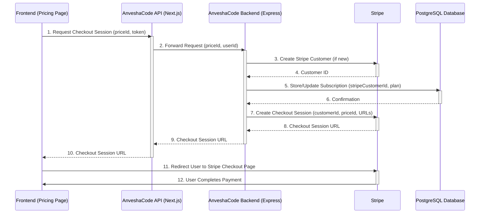
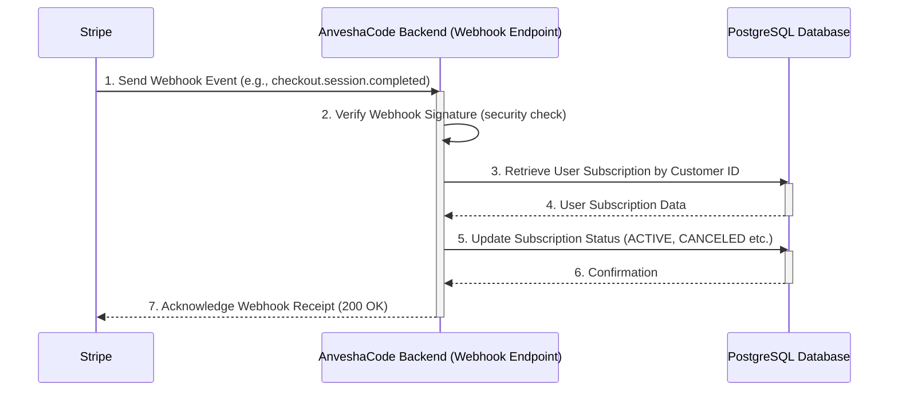

# Chapter 4: Payment & Subscription System

Welcome back to AnveshaCode! In our [last chapter: Database Management with Prisma](03_database_management_with_prisma_.md), we explored how AnveshaCode reliably stores all your important data, from user profiles to code reviews, using PostgreSQL and Prisma. We learned that a well-organized database is key to a robust application.

### The Problem: How Do We Charge for Awesome Features?

AnveshaCode offers powerful AI code reviews, but to cover the costs of running the AI models and maintaining the platform, we need a way for users to pay for advanced features or unlimited reviews. Imagine a premium library service: you get more books, faster access, and special tutoring, but you need a membership!

Setting up billing, handling different plans, processing credit card payments, and keeping track of who has paid what can be incredibly complex. It involves secure transactions, managing recurring payments (subscriptions), and knowing when a user's plan starts or ends.

### AnveshaCode's Solution: Stripe – Your Smart Payment Assistant

AnveshaCode solves this by using **Stripe**. Think of Stripe as our dedicated, super-secure financial department. Instead of building all the complicated payment infrastructure ourselves, we let Stripe handle it. This includes:

*   **Secure Payment Processing:** Taking credit card details safely.
*   **Subscription Management:** Handling monthly or yearly payments automatically.
*   **Billing Cycles:** Knowing when to charge next.
*   **Invoicing:** Generating receipts for payments.
*   **Responding to Events:** Telling AnveshaCode if a payment was successful or failed.

This system ensures that users have access to features corresponding to their paid plans, just like a key card grants access to premium areas of a library.

Let's look at a central use case:

**Use Case: Subscribing to a Plan**
A user wants to upgrade from a free account to a "Pro" plan to get more code reviews. They visit the pricing page, select the Pro plan, and complete the payment. After successful payment, their account is instantly updated to reflect the Pro subscription, giving them access to the new limits.

### Key Concepts

To understand AnveshaCode's payment system, let's break down its main components:

1.  **Stripe (The Payment Processor):** This is the external service that handles all the money-related stuff. AnveshaCode tells Stripe what to charge, and Stripe takes care of the rest.

2.  **Subscription Plans:** These are the different packages users can choose from (e.g., Basic, Advanced, Enterprise), each with different prices and features. In AnveshaCode, these are mapped to Stripe "Prices" (e.g., a monthly price for the Basic plan).

3.  **Checkout Session:** When you click "Subscribe" on a pricing page, AnveshaCode asks Stripe to create a secure, temporary payment page called a "checkout session." You enter your payment details directly on Stripe's page, so AnveshaCode never touches your sensitive financial information.

4.  **Webhooks:** After you pay, how does AnveshaCode know your payment was successful? Stripe sends automatic messages, called "webhooks," to AnveshaCode's backend. These messages tell AnveshaCode about important events, like a successful payment, a subscription update, or a cancellation. AnveshaCode "listens" for these messages and updates your user account and subscription status in its own database accordingly.

5.  **Customer Portal:** Stripe also provides a "Customer Portal," a special page where users can manage their subscriptions themselves – update billing info, change plans, or cancel. AnveshaCode can link users directly to this portal.

6.  **Invoice Verification:** AnveshaCode generates "digital invoices" (like receipts). These invoices include a unique ID that can be used to verify the payment's legitimacy directly with Stripe, enhancing trust and transparency.

### How to Use the Payment & Subscription System

From a user's perspective, you'll interact with this system on the `Pricing` page and the `Invoice` page.

#### 1. Choosing a Plan and Subscribing (`/pricing` page)

When you land on the pricing page, you see different plans and choose a billing cycle (monthly/yearly). Clicking "Get Started" or "Subscribe" initiates the payment process.

Here's how the frontend triggers a Stripe checkout:

```typescript
// frontend/app/pricing/page.tsx (simplified handleSubscribe function)
import { loadStripe } from "@stripe/stripe-js";
// ... (other imports) ...

const stripePromise = loadStripe(process.env.NEXT_PUBLIC_STRIPE_PUBLISHABLE_KEY!);

export default function PricingPage() {
  // ... (state and other logic) ...

  const handleSubscribe = async (priceId: string) => {
    try {
      if (!user) {
        window.location.href = '/signup'; // Redirect if not logged in
        return;
      }
      const stripe = await stripePromise;
      if (!stripe) throw new Error('Stripe failed to initialize');

      const token = localStorage.getItem('token'); // Get user's authentication token
      if (!token) {
        window.location.href = '/signin';
        return;
      }

      // Call our backend API to create a Stripe checkout session
      const response = await fetch('/api/create-checkout-session', {
        method: 'POST',
        headers: { 'Content-Type': 'application/json' },
        body: JSON.stringify({ priceId, token }), // Send price ID and user token
      });

      const data = await response.json();
      if (data.url) {
        window.location.href = data.url; // Redirect user to Stripe's secure checkout page
      } else {
        console.error('No URL in response:', data);
      }
    } catch (error) {
      console.error('Error:', error);
    }
  };

  return (
    // ... (JSX for plan selection and buttons) ...
    <Button onClick={() => handleSubscribe(plan.priceId[billingCycle]!)}>
      {user ? 'Get Started' : 'Sign up to subscribe'}
    </Button>
    // ...
  );
}
```
This code block shows how, when you click a plan, the `handleSubscribe` function is called. It gets your authentication `token` (from [Chapter 2: User Authentication & Authorization](02_user_authentication___authorization_.md)) and sends a request to AnveshaCode's backend `/api/create-checkout-session` endpoint, including the `priceId` of the selected plan. The backend then communicates with Stripe to get a special URL, which the frontend uses to redirect you to Stripe's secure payment page.

#### 2. Viewing Your Invoice (`/invoice` page)

After a successful payment, Stripe redirects you back to a page like `/invoice?success=true`. AnveshaCode then fetches the invoice details for you.

```typescript
// frontend/app/invoice/page.tsx (simplified InvoiceContent component)
import { useSearchParams } from "next/navigation";
import { useAuth } from "@/lib/auth-context";
// ... (other imports) ...

function InvoiceContent() {
  const searchParams = useSearchParams();
  const { user } = useAuth();
  const [invoice, setInvoice] = useState<any | null>(null);

  useEffect(() => {
    const fetchInvoice = async () => {
      const invoiceId = searchParams.get('id'); // Get invoice ID from URL
      if (!invoiceId) return;

      try {
        const token = localStorage.getItem('token');
        if (!token) { window.location.href = '/signin'; return; }

        // Call our backend API to get invoice details
        const response = await fetch(`${process.env.NEXT_PUBLIC_BACKEND_URL}/api/stripe/invoice/${invoiceId}`, {
          headers: { 'Authorization': `Bearer ${token}` },
        });

        const data = await response.json();
        setInvoice(data); // Store invoice data
      } catch (error) {
        console.error('Error fetching invoice:', error);
      }
    };
    fetchInvoice();
  }, [searchParams]);

  if (!invoice) return <div>Loading invoice...</div>; // Show loading
  
  return (
    // ... (JSX to display invoice details from 'invoice' state) ...
    <CardTitle>Invoice #{invoice.id}</CardTitle>
    // ...
  );
}
```
This snippet shows how the `InvoiceContent` component reads the `id` from the URL, then uses your `token` to ask the backend for the full invoice details. Once received, it displays the plan, amount, status, and other payment information.

#### 3. Verifying an Invoice (`/invoice/verify/[id]` page)

AnveshaCode also allows you to verify an invoice's authenticity using a direct link, often via a QR code on the PDF invoice itself.

```typescript
// frontend/app/invoice/verify/[id]/page.tsx (simplified)
import { useEffect, useState } from "react";
import { useParams } from "next/navigation";
// ... (other imports) ...

export default function InvoiceVerificationPage() {
  const params = useParams(); // Get the ID from the URL (e.g., /invoice/verify/sub_abc123)
  const [verificationData, setVerificationData] = useState<any | null>(null);
  const [loading, setLoading] = useState(true);

  useEffect(() => {
    const verifyInvoice = async () => {
      if (!params.id) return;
      try {
        // Call backend API to verify invoice by ID
        const response = await fetch(
          `${process.env.NEXT_PUBLIC_BACKEND_URL}/api/stripe/verify-invoice/${params.id}`,
          { method: 'GET' }
        );
        const data = await response.json();
        setVerificationData(data); // Store verification result
      } catch (error) {
        console.error('Error verifying invoice:', error);
      } finally {
        setLoading(false);
      }
    };
    verifyInvoice();
  }, [params.id]);

  if (loading) return <div>Verifying invoice...</div>;

  return (
    // ... (JSX to display whether the invoice is valid or not) ...
    <h1 className="text-3xl font-bold">
      {verificationData?.isValid ? 'Valid Invoice' : 'Invalid Invoice'}
    </h1>
    // ...
  );
}
```
This page sends the `subscriptionId` found in the URL directly to a public backend endpoint (`/api/stripe/verify-invoice/[id]`) to check its validity.

### Under the Hood: How Stripe Connects It All

Let's see how AnveshaCode's backend communicates with Stripe and keeps your subscription status updated in the database.

#### 1. User Subscribes to a Plan (Frontend initiates checkout)



Let's look at the backend code for step 7 in more detail:

```typescript
// backend/src/app/routes/stripe.ts (simplified /create-checkout-session route)
import { Router } from 'express';
import { createCheckoutSession } from '../../services/stripe'; // Helper to talk to Stripe
import { authenticate } from '../../auth/middleware/auth.middleware'; // From Chapter 2
import { PrismaClient, SubscriptionPlan } from '@prisma/client'; // From Chapter 3

const router = Router();
const prisma = new PrismaClient(); // Our database connection

router.post('/create-checkout-session', authenticate, async (req, res) => {
  const { priceId, successUrl, cancelUrl } = req.body;
  const userId = req.user?.id; // Authenticated user ID

  // ... error checks for userId and priceId ...

  // 1. Get or Create Stripe Customer linked to our user
  const customer = await stripe.customers.create({ metadata: { userId: userId } });

  // 2. Store customer ID and selected plan in our database (Prisma)
  await prisma.subscription.upsert({
    where: { userId: userId },
    update: { stripeCustomerId: customer.id, stripePriceId: priceId, plan: getPlanFromPriceId(priceId) },
    create: { userId: userId, stripeCustomerId: customer.id, stripePriceId: priceId, plan: getPlanFromPriceId(priceId), status: 'INACTIVE' },
  });

  // 3. Create the Stripe Checkout Session
  const session = await createCheckoutSession(priceId, customer.id, successUrl, cancelUrl);
  return res.json({ url: session.url }); // Send the URL back to frontend
});
```
This backend route (`/api/stripe/create-checkout-session`):
1.  **Authenticates** the user to know who is making the request (using `authenticate` middleware from [Chapter 2: User Authentication & Authorization](02_user_authentication___authorization_.md)).
2.  Creates or retrieves a **Stripe Customer** object, linking it to our internal `userId` using `metadata`.
3.  **Updates our database** using Prisma (from [Chapter 3: Database Management with Prisma](03_database_management_with_prisma_.md)) to store the `stripeCustomerId` and the chosen `SubscriptionPlan` for the user. We set the status as `INACTIVE` for now, as payment isn't confirmed yet.
4.  Calls Stripe's API to create a `checkout.session`. This session is Stripe's secure payment page.
5.  Sends the `session.url` back to the frontend, so the user can be redirected to Stripe.

The `createCheckoutSession` helper function encapsulates the direct call to Stripe:

```typescript
// backend/src/services/stripe.ts (simplified createCheckoutSession)
import Stripe from 'stripe';

export const stripe = new Stripe(process.env.STRIPE_SECRET_KEY!, {
  apiVersion: '2025-04-30.basil', // Specific Stripe API version
});

export async function createCheckoutSession(
  priceId: string,
  customerId: string,
  successUrl?: string,
  cancelUrl?: string
) {
  const session = await stripe.checkout.sessions.create({
    customer: customerId, // Link to the Stripe customer
    line_items: [{ price: priceId, quantity: 1 }], // The plan being bought
    mode: 'subscription', // Important: This is for recurring payments
    success_url: successUrl, // Where Stripe redirects after success
    cancel_url: cancelUrl,   // Where Stripe redirects after cancellation
  });
  return session;
}
```
This is the heart of creating the payment flow. It uses the `stripe` object (our connection to Stripe's API) to generate the `checkout.session`.

#### 2. Stripe Informs AnveshaCode About Payment Events (Webhooks)

This is a critical part! After the user completes payment on Stripe's page, Stripe sends an automatic "webhook" message to AnveshaCode. AnveshaCode's webhook endpoint listens for these messages to update the user's subscription status in the database.



Let's look at the backend code for the webhook handler:

```typescript
// backend/src/app/routes/stripe.ts (simplified /webhook route)
import { Router } from 'express';
import { stripe } from '../../services/stripe'; // Our Stripe connection
import { PrismaClient } from '@prisma/client'; // From Chapter 3
import Stripe from 'stripe';

const router = Router();
const prisma = new PrismaClient();

router.post('/webhook', async (req, res) => {
  const sig = req.headers['stripe-signature']; // Stripe's security signature
  let event;

  try {
    // Verify the webhook came from Stripe and is not tampered with
    event = stripe.webhooks.constructEvent(
      req.body,
      sig as string,
      process.env.STRIPE_WEBHOOK_SECRET as string
    );
  } catch (error) {
    console.error('Webhook signature verification failed:', error);
    return res.status(400).send(`Webhook Error`);
  }

  try {
    switch (event.type) {
      case 'checkout.session.completed': { // When a payment succeeds
        const session = event.data.object as Stripe.Checkout.Session;
        const customerId = session.customer as string;
        const userId = (await stripe.customers.retrieve(customerId) as Stripe.Customer).metadata?.userId;
        const subscriptionId = session.subscription as string;
        const priceId = session.line_items?.data[0]?.price?.id;

        await prisma.subscription.update({ // Update our DB
          where: { userId },
          data: {
            stripeSubscriptionId: subscriptionId,
            status: 'ACTIVE', // Mark as active!
            plan: getPlanFromPriceId(priceId!),
            currentPeriodStart: new Date(),
            currentPeriodEnd: new Date(Date.now() + 30 * 24 * 60 * 60 * 1000), // Approx. next month
          },
        });
        break;
      }
      case 'customer.subscription.updated': { // When a subscription changes (e.g., plan upgrade, renewal)
        const subscription = event.data.object as Stripe.Subscription;
        const customerId = subscription.customer as string;
        const userId = (await stripe.customers.retrieve(customerId) as Stripe.Customer).metadata?.userId;
        const priceId = subscription.items.data[0].price.id;

        await prisma.subscription.update({
          where: { userId },
          data: {
            status: subscription.status.toUpperCase() as any, // Update status (ACTIVE, CANCELED, etc.)
            plan: getPlanFromPriceId(priceId),
            currentPeriodStart: new Date(subscription.current_period_start * 1000),
            currentPeriodEnd: new Date(subscription.current_period_end * 1000),
          },
        });
        break;
      }
      case 'customer.subscription.deleted': { // When a subscription is cancelled or ends
        const subscription = event.data.object as Stripe.Subscription;
        const customerId = subscription.customer as string;
        const userId = (await stripe.customers.retrieve(customerId) as Stripe.Customer).metadata?.userId;

        await prisma.subscription.update({
          where: { userId },
          data: {
            status: 'CANCELED', // Mark as canceled
            currentPeriodStart: new Date(subscription.current_period_start * 1000),
            currentPeriodEnd: new Date(subscription.current_period_end * 1000),
          },
        });
        break;
      }
      default:
        console.log(`Unhandled event type ${event.type}`);
    }
    return res.json({ received: true });
  } catch (error) {
    console.error('Error processing webhook:', error);
    return res.status(500).json({ error: 'Error processing webhook' });
  }
});
```
This webhook endpoint is designed to be the "listener" for Stripe events.
1.  It first **verifies the event's authenticity** using a secret key to ensure it's truly from Stripe.
2.  Then, it uses a `switch` statement to handle different types of events:
    *   `checkout.session.completed`: When a new subscription payment is successful. It retrieves the `userId` from Stripe's customer metadata and updates the AnveshaCode `Subscription` table in the database to `ACTIVE`.
    *   `customer.subscription.updated`: When a subscription's status changes (e.g., from `ACTIVE` to `PAST_DUE` if a payment fails, or when a plan is upgraded/downgraded). It updates the `status` and `plan` in the database.
    *   `customer.subscription.deleted`: When a subscription is canceled or expires. It updates the status to `CANCELED`.
This mechanism ensures that AnveshaCode's database is always up-to-date with the user's actual subscription status on Stripe.

#### 3. Getting and Verifying Invoice Data

AnveshaCode also has endpoints to retrieve invoice details and verify them, which the frontend uses.

```typescript
// backend/src/app/routes/stripe.ts (simplified /invoice and /verify-invoice/:subscriptionId routes)
router.get('/invoice', authenticate, async (req, res) => {
  const userId = req.user?.id;
  // ... (logic to fetch subscription details from our DB and Stripe) ...
  // It constructs a detailed invoice object and sends it back to the frontend.
});

router.get('/verify-invoice/:subscriptionId', async (req, res) => {
  const { subscriptionId } = req.params;

  const subscription = await prisma.subscription.findFirst({
    where: { stripeSubscriptionId: subscriptionId },
  });

  if (!subscription) {
    return res.status(404).json({ isValid: false, message: 'Invoice not found' });
  }

  // Optionally, you can also hit Stripe here to re-verify if needed,
  // but checking our database provides a quick verification.
  return res.json({
    isValid: true,
    message: 'This is a valid invoice',
    invoiceData: {
      planName: subscription.plan || 'Unknown',
      status: subscription.status,
      startDate: subscription.currentPeriodStart?.toISOString(),
      endDate: subscription.currentPeriodEnd?.toISOString(),
    },
  });
});
```
The `/invoice` endpoint (which is authenticated) pulls data from both AnveshaCode's database and Stripe to give a complete picture of the user's current subscription. The `/verify-invoice/:subscriptionId` endpoint (which is public) checks if a given `subscriptionId` exists in AnveshaCode's database and returns its status, allowing for external verification of an invoice.

### Conclusion

In this chapter, we've explored the **Payment & Subscription System** in AnveshaCode. We learned how Stripe acts as our secure payment processor, handling everything from collecting payments through "checkout sessions" to managing recurring "subscriptions." Crucially, we understood how "webhooks" enable Stripe to communicate important payment events back to AnveshaCode, allowing us to keep our user's subscription status updated in our database using Prisma. This system is vital for monetizing the powerful AI features of AnveshaCode and ensuring users have access to the right set of features.

Next, we'll see how these payment plans translate into actual feature access by diving into [Chapter 5: Subscription & Review Limits](05_subscription___review_limits_.md).

[Next Chapter: Subscription & Review Limits](05_subscription___review_limits_.md)

---