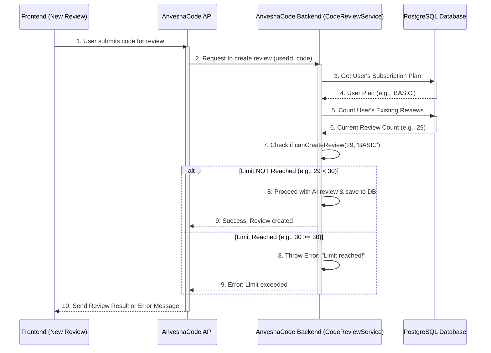

# Chapter 5: Subscription & Review Limits

Welcome back to AnveshaCode! In our [last chapter: Payment & Subscription System](04_payment___subscription_system_.md), we saw how AnveshaCode uses Stripe to handle payments and subscriptions, letting users sign up for different plans. We learned that paying for a plan makes your account "active" and ready for more features.

### The Problem: Fair Usage of Powerful AI

AnveshaCode's core feature, the AI code review, is powered by advanced AI models. These models are amazing, but they also cost money to run. If everyone could use them unlimited times for free, it would be very expensive for us to provide the service!

So, how do we make sure that users get the features they paid for, while also ensuring that resources are used fairly and sustainably? This is where **Subscription & Review Limits** come in. It's like a bouncer at a theme park ride: your ticket (subscription plan) allows you a certain number of rides (code reviews). If you've used all your rides, the bouncer (the limits system) politely asks you to upgrade your ticket!

Let's look at a central use case:

**Use Case: Checking Review Allowance Before Submitting Code**
A user is on the "Basic" plan, which allows them 30 code reviews per month. They have already used 29 reviews. When they try to submit a 30th piece of code for review, it works! But when they try to submit a 31st, AnveshaCode tells them they've reached their limit and suggests upgrading their plan.

### Key Concepts

To understand how AnveshaCode manages review limits, let's break down the important ideas:

1.  **Subscription Plan (from Chapter 4):** This is the plan you've paid for, like "Basic," "Advanced," or "Enterprise." Each plan comes with different benefits, including review limits.

2.  **Review Limits:** This is the *maximum number* of code reviews allowed for each subscription plan.
    *   **NONE (Free Users):** Can do 5 reviews (to try out the service).
    *   **BASIC:** Can do 30 reviews.
    *   **ADVANCED:** Can do 200 reviews.
    *   **ENTERPRISE:** Can do unlimited reviews.

3.  **Current Review Count:** This is how many code reviews a user has already performed within their current billing period. AnveshaCode keeps track of every review you submit.

4.  **The Gatekeeper (`canCreateReview`):** This is the special logic that checks two things:
    *   What is the user's `Subscription Plan`?
    *   What is their `Current Review Count`?
    It then compares the `Current Review Count` to the `Review Limit` for their plan. If the count is less than the limit, the user is allowed to proceed. If it's equal to or more than the limit, the user is stopped.

### How AnveshaCode Uses Review Limits

From a user's perspective, the system works quietly in the background. You'll primarily see its effect in two places:

1.  **When you try to submit a new code review:** If you're over the limit, you'll get an error message.
2.  **On your Dashboard or Profile page:** AnveshaCode will often show you how many reviews you have used and how many are remaining for your current plan.

Let's look at some simplified code snippets that show these interactions:

#### 1. Displaying Your Current Review Status (Frontend)

AnveshaCode's frontend can fetch your subscription status to show you how many reviews you have left.

```typescript
// frontend/components/SubscriptionStatusDisplay.tsx (simplified)
import { useEffect, useState } from "react";
import { useAuth } from "@/lib/auth-context"; // Your user info from Chapter 2

export default function SubscriptionStatusDisplay() {
  const { user } = useAuth();
  const [status, setStatus] = useState({
    plan: "Loading...",
    currentReviews: 0,
    reviewLimit: 0,
    remainingReviews: 0
  });

  useEffect(() => {
    const fetchStatus = async () => {
      if (!user) return; // Need a logged-in user

      const token = localStorage.getItem('token');
      const response = await fetch('/api/code-reviews/subscription-status', {
        headers: { 'Authorization': `Bearer ${token}` }
      });
      const data = await response.json();
      setStatus(data); // Update state with fetched status
    };
    fetchStatus();
  }, [user]);

  if (!user) return null; // Don't show if not logged in

  return (
    <div className="text-sm text-gray-600">
      Your Plan: <span className="font-semibold">{status.plan}</span> <br/>
      Reviews Used: <span className="font-semibold">{status.currentReviews}</span> / <span className="font-semibold">{status.reviewLimit === Infinity ? "Unlimited" : status.reviewLimit}</span> <br/>
      Remaining: <span className="font-semibold">{status.remainingReviews === Infinity ? "Unlimited" : status.remainingReviews}</span>
    </div>
  );
}
```
This frontend component calls a special backend API (`/api/code-reviews/subscription-status`) to get your current review count and limit. It then displays this helpful information to you.

#### 2. Trying to Create a New Review (Frontend & Backend Interaction)

When you click "Review Code" (from [Chapter 1: AI Code Review Core](01_ai_code_review_core_.md)), the frontend sends your code to the backend. The backend then performs the limit check *before* actually sending your code to the AI.

```typescript
// frontend/app/new-review/page.tsx (simplified error handling)
import { useState } from "react";
import { toast } from 'react-toastify'; // For displaying messages

export default function NewReviewPage() {
  const [pastedCode, setPastedCode] = useState("");
  const [isLoading, setIsLoading] = useState(false);

  const handlePasteReview = async () => {
    if (!pastedCode.trim()) return;

    setIsLoading(true);
    try {
      const token = localStorage.getItem('token');
      const response = await fetch('/api/code-reviews', { // Call backend to create review
        method: 'POST',
        headers: {
          'Content-Type': 'application/json',
          'Authorization': `Bearer ${token}`
        },
        body: JSON.stringify({ code: pastedCode, fileName: "example.js" }),
      });

      const data = await response.json();
      if (!response.ok) {
        // Handle specific errors from the backend, including limit errors
        toast.error(data.message || 'Failed to get code review');
        return;
      }
      // If successful, display the review (as seen in Chapter 1)
      toast.success('Code reviewed successfully!');
    } catch (error) {
      console.error("Review failed:", error);
      toast.error('An unexpected error occurred.');
    } finally {
      setIsLoading(false);
    }
  };

  return (
    <div>
      {/* Textarea and Button as shown in Chapter 1 */}
      <button onClick={handlePasteReview} disabled={isLoading}>
        {isLoading ? "Analyzing..." : "Review Code"}
      </button>
    </div>
  );
}
```
This simplified frontend code shows that if the backend responds with an error (e.g., a 403 status code with a message about review limits), the frontend catches it and displays a user-friendly message using `toast.error`.

### Under the Hood: How AnveshaCode Enforces Limits

Let's peek behind the curtain to see how AnveshaCode acts as the gatekeeper for code reviews.



Here's a closer look at the key backend pieces:

#### 1. Defining Review Limits (`backend/src/utils/subscription.ts`)

This is where the actual numbers for each plan's review limit are defined. It also contains helper functions to easily check limits.

```typescript
// backend/src/utils/subscription.ts
import { SubscriptionPlan } from '@prisma/client';

// Define the hard limits for each subscription plan
export const REVIEW_LIMITS = {
  NONE: 5,         // Free users get 5 reviews
  BASIC: 30,       // Basic plan gets 30 reviews
  ADVANCED: 200,   // Advanced plan gets 200 reviews
  ENTERPRISE: Infinity // Enterprise gets unlimited reviews
};

// Helper function to get the limit for a given plan
export function getReviewLimit(plan: SubscriptionPlan | null): number {
  if (!plan) return REVIEW_LIMITS.NONE; // If no plan, assume 'NONE'
  return REVIEW_LIMITS[plan]; // Return the limit based on the plan enum
}

// The core gatekeeper function: checks if a review can be created
export function canCreateReview(currentReviewCount: number, plan: SubscriptionPlan | null): boolean {
  const limit = getReviewLimit(plan); // Get the limit for the user's plan
  return currentReviewCount < limit;   // Is current count less than the limit?
}
```
This file provides the central logic for determining limits. `Infinity` means there's no limit.

#### 2. Enforcing Limits During Review Creation (`backend/src/services/codeReview.service.ts`)

The `CodeReviewService` is where a new code review is processed. Before saving the review, it uses the `canCreateReview` function to perform the limit check.

```typescript
// backend/src/services/codeReview.service.ts (simplified createReview method)
import { PrismaClient } from '@prisma/client';
import { canCreateReview, getReviewLimit } from '../utils/subscription'; // Our limit helpers

const prisma = new PrismaClient(); // Our database connection (from Chapter 3)

export class CodeReviewService {
  static async createReview(data: any, userId: string) {
    // 1. Fetch user's subscription and current review count from the database
    const [user, reviewCount] = await Promise.all([
      prisma.user.findUnique({ // Find user details
        where: { id: userId },
        include: { subscription: true } // Also get their subscription details
      }),
      prisma.codeReview.count({ // Count reviews by this user
        where: { userId }
      })
    ]);

    // 2. Determine the user's plan (default to NONE if no subscription)
    const userPlan = user?.subscription?.plan || null;

    // 3. Use the gatekeeper function to check if a new review is allowed
    if (!canCreateReview(reviewCount, userPlan)) {
      throw new Error(
        'You have reached your code review limit for your current subscription plan. Please upgrade to review more code.'
      );
    }

    // 4. If allowed, proceed to create the review in the database
    return prisma.codeReview.create({
      data: {
        userId,
        fileName: data.fileName,
        code: data.code,
        review: data.review,
        score: data.score,
        issuesCount: data.issuesCount,
        // ... more review data ...
        status: 'COMPLETED'
      }
    });
  }

  // ... (other methods like getUserReviews, getReviewById, deleteReview) ...

  // Method to get the subscription status (used by frontend)
  static async getSubscriptionStatus(userId: string): Promise<any> {
    const [user, reviewCount] = await Promise.all([
      prisma.user.findUnique({ where: { id: userId }, include: { subscription: true } }),
      prisma.codeReview.count({ where: { userId } })
    ]);

    const plan = user?.subscription?.plan || null;
    const reviewLimit = getReviewLimit(plan);
    const remainingReviews = reviewLimit === Infinity ? Infinity : reviewLimit - reviewCount;

    return {
      plan: plan || 'NONE',
      currentReviews: reviewCount,
      reviewLimit,
      remainingReviews
    };
  }
}
```
This is the core implementation of the use case. The `createReview` method fetches both the user's subscription and their existing review count, then calls `canCreateReview`. If `canCreateReview` returns `false`, it `throws an Error`, which prevents the review from being created. The `getSubscriptionStatus` method provides the data for the frontend display.

#### 3. Handling Limit Errors at the API Layer (`backend/src/app/routes/code-review-routes.ts`)

The API routes are the entry point for frontend requests. They must be prepared to catch errors thrown by the `CodeReviewService`.

```typescript
// backend/src/app/routes/code-review-routes.ts (simplified POST / route)
import express, { Request, Response } from 'express';
import { authenticateToken } from '../../auth/middleware/auth'; // From Chapter 2
import { CodeReviewService } from '../../services/codeReview.service';

const router = express.Router();

interface AuthRequest extends Request {
  user?: { id: string; email: string };
}

// Route to create a new code review
router.post('/', authenticateToken, async (req: AuthRequest, res: Response): Promise<Response> => {
  try {
    if (!req.user) {
      return res.status(401).json({ message: 'User not authenticated' });
    }
    const userId = req.user.id;
    const { fileName, code, review, score, issuesCount, language } = req.body;

    // Call the service to create the review
    const newCodeReview = await CodeReviewService.createReview({
      fileName, code, review, score, issuesCount, language
    }, userId);

    return res.status(201).json(newCodeReview); // Success!
  } catch (error: any) {
    console.error('Error creating code review:', error);
    // Check if the error is specifically about the review limit
    if (error.message.includes('code review limit')) {
      return res.status(403).json({ message: error.message }); // Send 403 Forbidden
    }
    return res.status(500).json({ message: 'Error creating code review' }); // Generic error
  }
});

// Route to get subscription status and remaining reviews
router.get('/subscription-status', authenticateToken, async (req: AuthRequest, res: Response): Promise<Response> => {
  try {
    if (!req.user) {
      return res.status(401).json({ message: 'User not authenticated' });
    }
    const userId = req.user.id;
    const status = await CodeReviewService.getSubscriptionStatus(userId); // Get status from service
    return res.json(status);
  } catch (error) {
    console.error('Error fetching subscription status:', error);
    return res.status(500).json({ message: 'Error fetching subscription status' });
  }
});

export default router;
```
This API route uses a `try...catch` block. If `CodeReviewService.createReview` throws an error due to the limit, the `catch` block intercepts it and sends a `403 Forbidden` HTTP status code along with the friendly error message back to the frontend. This is how the frontend knows to display the "limit reached" message. It also exposes the `/subscription-status` endpoint for the frontend to fetch current usage.

#### 4. Subscription Plan Definitions (`backend/prisma/schema.prisma`)

Finally, the `SubscriptionPlan` definitions from [Chapter 3: Database Management with Prisma](03_database_management_with_prisma_.md) are critical because they dictate the types of plans and thus, the limits that apply.

```prisma
// backend/prisma/schema.prisma (relevant part)

// Defines the possible types of subscription plans
enum SubscriptionPlan {
  BASIC
  ADVANCED
  ENTERPRISE
}

model Subscription {
  // ... other fields for subscription ...
  plan              SubscriptionPlan? // Links to the SubscriptionPlan enum
  // ...
}
```
This `enum` (short for "enumeration") lists all the valid plan types. The `Subscription` model then uses this `SubscriptionPlan` type to link a user's subscription record to a specific plan, which in turn maps to the `REVIEW_LIMITS` defined in our utility file.

### Conclusion

In this chapter, we've explored **Subscription & Review Limits**. We learned that this system acts as a crucial gatekeeper, ensuring fair usage of AnveshaCode's AI review features based on a user's chosen subscription plan. We saw how specific review limits are defined for each plan, how AnveshaCode keeps track of your current review count, and how the system intelligently checks these limits before allowing a new review. This mechanism is key to managing resources and providing a sustainable service.

Now that we understand the core features and how they're managed, let's look at how all these pieces come together in the bigger picture: the **Backend API Layer**.

[Next Chapter: Backend API Layer](06_backend_api_layer_.md)

---