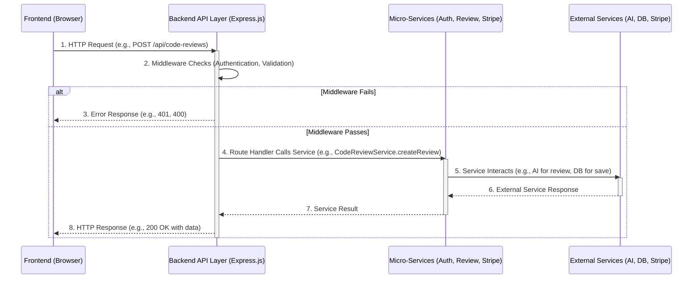

# Chapter 6: Backend API Layer

Welcome back to AnveshaCode! In our previous chapters, we've explored many amazing parts of our application:
*   [Chapter 1: AI Code Review Core](01_ai_code_review_core_.md) taught us how AnveshaCode uses AI to analyze your code.
*   [Chapter 2: User Authentication & Authorization](02_user_authentication___authorization_.md) showed how we know who you are and keep your account secure.
*   [Chapter 3: Database Management with Prisma](03_database_management_with_prisma_.md) explained how all your important data is safely stored.
*   [Chapter 4: Payment & Subscription System](04_payment___subscription_system_.md) covered how we handle subscriptions with Stripe.
*   [Chapter 5: Subscription & Review Limits](05_subscription___review_limits_.md) demonstrated how we ensure fair usage based on your plan.

All these pieces are fantastic, but they don't work in isolation. How does your web browser (the "frontend" you see) actually *talk* to all these powerful "backend" systems and get them to do things? This is where the **Backend API Layer** comes in!

### The Problem: How Do Different Parts of the Application Talk to Each Other?

Imagine AnveshaCode is a large company with many specialized departments: the AI Department, the User Accounts Department, the Billing Department, and the Data Storage Department.

When you, as a user, click a button on the AnveshaCode website (your "frontend"), you're essentially making a request. For example, you want to:
*   "Review my code!"
*   "Log me in!"
*   "Show me my past reviews!"
*   "Let me subscribe to the Pro plan!"

How does the website know *who* to ask, *what* to ask for, and *where* to send your request? And how does it get the answer back? Without a clear communication system, it would be chaos!

### AnveshaCode's Solution: Your Central Communication Hub

The **Backend API Layer** is the communication hub, or "receptionist," for AnveshaCode. It defines all the rules and "doorways" for how the frontend (what you see) can interact with the powerful backend services (like the AI, database, or payment system).

It's the primary interface that listens for requests from your browser, understands them, directs them to the right "department," gathers the results, and sends them back to you. AnveshaCode uses a technology called **Express.js** to build this powerful API layer.

Let's look at a central use case:

**Use Case: Submitting Code for AI Review**
You've pasted your code into the AnveshaCode website and clicked "Review Code." The website needs to send your code to the backend, get it reviewed by the AI, check your review limits, save the review, and then show you the results. The Backend API Layer makes all of this possible.

### Key Concepts

Let's break down the main ideas behind the Backend API Layer:

1.  **API Endpoints (Routes):** Think of these as specific "doorways" or addresses for different requests. Each endpoint has a unique URL path.
    *   `/api/auth/login`: The doorway for logging in.
    *   `/api/code-reviews`: The doorway for submitting code or getting past reviews.
    *   `/api/stripe/create-checkout-session`: The doorway for starting a subscription payment.

2.  **HTTP Methods (GET, POST, PUT, DELETE):** These are the "actions" you want to perform at an endpoint.
    *   **GET:** To *get* (read) information (e.g., `GET /api/code-reviews` to get your review history).
    *   **POST:** To *create* new information (e.g., `POST /api/code-reviews` to submit new code for review).
    *   **PUT:** To *update* existing information (e.g., `PUT /api/auth/profile` to change your name).
    *   **DELETE:** To *delete* information (e.g., `DELETE /api/code-reviews/123` to delete a specific review).

3.  **Request & Response:**
    *   **Request:** What your frontend sends to an API endpoint. This usually includes:
        *   The **HTTP Method** (e.g., POST).
        *   The **Endpoint URL** (e.g., `/api/code-reviews`).
        *   The **Body** (the actual data, like your code).
        *   **Headers** (extra info, like your authentication token).
    *   **Response:** What the API layer sends back to your frontend after processing the request. This usually includes:
        *   A **Status Code** (e.g., `200 OK` for success, `401 Unauthorized` if you're not logged in, `403 Forbidden` if you hit a limit, `500 Internal Server Error` if something went wrong).
        *   A **Body** (the actual data you asked for, like the AI's review).

4.  **Middleware:** These are special "checkpoints" or "security guards" that requests pass through *before* reaching the main logic for an endpoint. They perform common tasks like:
    *   **Authentication:** Checking your digital ID (token) to make sure you're logged in ([Chapter 2: User Authentication & Authorization](02_user_authentication___authorization_.md)).
    *   **Validation:** Ensuring the data you sent (e.g., email format, password strength) is correct ([`backend/src/auth/middleware/validate.middleware.ts`](backend/src/auth/middleware/validate.middleware.ts)).
    *   **Logging:** Recording the request for debugging.

5.  **JSON (JavaScript Object Notation):** This is the common "language" or format used to send data between the frontend and backend. It's easy for both humans and computers to read and write.

    ```json
    // Example JSON data (sending code for review)
    {
      "fileName": "my_code.js",
      "code": "console.log('Hello, AnveshaCode!');"
    }
    ```

### How to Use the Backend API Layer (From the Frontend's View)

From your perspective as a user, you just click buttons. But behind the scenes, the AnveshaCode frontend makes `fetch` requests (or uses similar tools) to these API endpoints.

Let's revisit some simple examples we've seen in earlier chapters:

#### 1. Submitting Code for Review ([Chapter 1](01_ai_code_review_core_.md))

When you click "Review Code," your browser sends a `POST` request to the `/api/code-reviews` endpoint.

```typescript
// frontend/app/new-review/page.tsx (simplified fetch call)
const response = await fetch('/api/code-reviews', { // Calling the API layer!
  method: 'POST', // We want to CREATE a new review
  headers: {
    'Content-Type': 'application/json', // We're sending JSON data
    'Authorization': `Bearer ${token}` // Your digital ID from Chapter 2
  },
  body: JSON.stringify({ // Your code and file name go here
    code: pastedCode,
    fileName: "example.js"
  }),
});

const data = await response.json(); // Get the AI's review back!
if (!response.ok) {
  throw new Error(data.message || 'Failed to get code review');
}
// If successful, 'data' contains the review, score, etc.
```
This snippet shows the `fetch` function sending a `POST` request to the `/api/code-reviews` endpoint. It includes your code in the `body` and your `token` in the `Authorization` header.

#### 2. Logging In ([Chapter 2](02_user_authentication___authorization_.md))

When you log in, your credentials go to the `/api/auth/login` endpoint.

```typescript
// frontend/app/signin/page.tsx (simplified fetch call)
const response = await fetch('/api/auth/login', {
  method: 'POST', // We're submitting credentials to log in
  headers: { 'Content-Type': 'application/json' },
  body: JSON.stringify(formData), // Your email and password
});

const data = await response.json();
if (!response.ok) {
  throw new Error(data.message || 'Login failed');
}
// If successful, 'data' contains your new authentication token
```
Here, your email and password are sent in the `body` of a `POST` request to the login endpoint. The backend processes it and sends back your `token` if successful.

#### 3. Creating a Stripe Checkout Session ([Chapter 4](04_payment___subscription_system_.md))

When you want to subscribe to a plan, the frontend asks the backend to set up the payment.

```typescript
// frontend/app/pricing/page.tsx (simplified fetch call)
const response = await fetch('/api/stripe/create-checkout-session', {
  method: 'POST', // We're asking to CREATE a checkout session
  headers: { 'Content-Type': 'application/json' },
  body: JSON.stringify({ priceId, token }), // Plan ID and your token
});

const data = await response.json();
if (data.url) {
  window.location.href = data.url; // Backend sends back a URL to Stripe!
}
```
This sends a `POST` request to `/api/stripe/create-checkout-session`. The backend (via the API layer) talks to Stripe, gets a special payment URL, and sends it back to the frontend, which then redirects your browser.

### Under the Hood: How the Backend API Layer Works

Let's look at how the Backend API Layer (built with Express.js) orchestrates these requests.



This diagram shows that when your Frontend makes an HTTP request, it first hits the `Backend API Layer`. The API Layer then runs `Middleware` (like a security check). If all checks pass, it directs the request to the correct `Micro-Service` (our internal backend code responsible for specific tasks), which then talks to `External Services` (like the AI, Database, or Stripe). Finally, the results are sent back through the API layer to your browser.

Now, let's dive into the simplified code that makes this happen:

#### 1. The Main Door: `backend/src/app.ts`

This file is the main entry point for our backend application. It sets up the Express.js server and tells it which "route files" (groups of API endpoints) to use.

```typescript
// backend/src/app.ts (simplified)
import express from 'express';
import cors from 'cors'; // For allowing frontend to talk to backend
import authRoutes from './auth/routes/auth-routes'; // Our authentication routes
import codeReviewRoutes from './app/routes/code-review-routes'; // Our code review routes
import stripeRoutes from './app/routes/stripe'; // Our Stripe payment routes

const app = express();
const PORT = process.env.PORT || 5000;

// Essential setup (Middleware for all requests)
app.use(cors()); // Allows frontend (different address) to connect
app.use(express.json()); // Automatically understands JSON data in requests

// Link main routes to specific URL paths
app.use('/api/auth', authRoutes);         // All auth routes start with /api/auth
app.use('/api/code-reviews', codeReviewRoutes); // All code review routes start with /api/code-reviews
app.use('/api/stripe', stripeRoutes);     // All Stripe routes start with /api/stripe

// Start listening for requests
app.listen(PORT, () => {
  console.log(`Server is running on port ${PORT}`);
});
```
This `app.ts` file is like the central switchboard. It first sets up basic rules (`cors`, `express.json`) that apply to all incoming requests. Then, crucial lines like `app.use('/api/auth', authRoutes)` tell Express: "If a request comes in starting with `/api/auth`, send it to the `authRoutes` file to handle." This organizes our API into logical groups.

#### 2. Defining API Endpoints: Route Files

Each `_routes.ts` file is responsible for defining the specific endpoints and their behaviors for a particular feature.

**A. Authentication Routes (`backend/src/auth/routes/auth-routes.ts`)**

```typescript
// backend/src/auth/routes/auth-routes.ts (simplified)
import express from 'express';
import { login, register } from './../controller/auth-controller'; // Functions that do the actual work
import { authenticate } from './../middleware/auth.middleware'; // Our security guard

const router = express.Router();

// Public routes (no authentication needed)
router.post('/register', register); // POST to /api/auth/register
router.post('/login', login);       // POST to /api/auth/login

// Protected route (requires authentication)
router.get('/profile', authenticate, /* ... getProfile function ... */); // GET to /api/auth/profile

export default router;
```
This file sets up endpoints for `auth` related tasks. Notice how `router.post('/register', register)` means "when a `POST` request comes to `/api/auth/register`, run the `register` function." For the `/profile` route, the `authenticate` middleware runs *first* to check the user's token before allowing the `getProfile` function to run.

**B. Code Review Routes (`backend/src/app/routes/code-review-routes.ts`)**

```typescript
// backend/src/app/routes/code-review-routes.ts (simplified)
import express from 'express';
import { authenticateToken } from '../../auth/middleware/auth'; // Our authentication middleware
import { CodeReviewService } from '../../services/codeReview.service'; // Our "worker" for reviews

const router = express.Router();

// Get all code reviews for a user (protected route)
router.get('/', authenticateToken, async (req, res) => {
  // Check if user is authenticated (handled by authenticateToken)
  const userId = req.user!.id; // req.user is set by authenticateToken
  const reviews = await CodeReviewService.getUserReviews(userId); // Call the service to get reviews
  return res.json(reviews); // Send reviews back as JSON
});

// Create a new code review (protected route)
router.post('/', authenticateToken, async (req, res) => {
  try {
    const userId = req.user!.id;
    const { fileName, code } = req.body; // Get data from the request body

    // Call the service to create the review, which includes limit checks (Chapter 5)
    const newCodeReview = await CodeReviewService.createReview({ fileName, code }, userId);

    return res.status(201).json(newCodeReview); // Send back the newly created review with 201 Created status
  } catch (error: any) {
    // If CodeReviewService threw an error (e.g., review limit reached)
    if (error.message.includes('code review limit')) {
      return res.status(403).json({ message: error.message }); // 403 Forbidden status
    }
    return res.status(500).json({ message: 'Error creating code review' });
  }
});

export default router;
```
This `code-review-routes.ts` file handles code review related requests. Both `GET /` (to fetch reviews) and `POST /` (to create a review) use `authenticateToken` to ensure only logged-in users can access them. The `POST /` route also demonstrates how the API layer catches errors from the `CodeReviewService` (like hitting a review limit from [Chapter 5: Subscription & Review Limits](05_subscription___review_limits_.md)) and sends an appropriate error message and status code (like `403 Forbidden`) back to the frontend.

#### 3. Middleware: The Security Guards (`backend/src/auth/middleware/auth.middleware.ts`)

Middleware functions run *before* the main route logic. They can inspect the request, modify it, or stop it if conditions aren't met.

```typescript
// backend/src/auth/middleware/auth.middleware.ts (simplified authenticate function)
import { Request, Response, NextFunction } from 'express';
import { verifyToken } from '../utils/jwt'; // Utility to check JWT (from Chapter 2)

// Extend the Request interface to add 'user'
declare global {
  namespace Express {
    interface Request {
      user?: { id: string; email: string; };
    }
  }
}

export const authenticate = async (req: Request, res: Response, next: NextFunction) => {
  const authHeader = req.headers.authorization;
  if (!authHeader || !authHeader.startsWith('Bearer ')) {
    return res.status(401).json({ message: 'Authentication required' }); // No token!
  }

  const token = authHeader.split(' ')[1];
  const decoded = verifyToken(token); // Check if the token is valid
  if (!decoded) {
    return res.status(401).json({ message: 'Invalid or expired token' }); // Bad token!
  }

  // If token is valid, attach user ID to the request object
  req.user = { id: decoded.id, email: decoded.email };
  next(); // Allow the request to proceed to the next function (the route handler)
};
```
This `authenticate` middleware (which `authenticateToken` also uses) is a great example. It checks if an `Authorization` header with a valid token is present. If not, it immediately sends a `401 Unauthorized` response. If valid, it attaches the user's information (`req.user`) to the request so that subsequent functions (like `CodeReviewService.createReview`) know who the user is. Then `next()` is called to pass control to the next function in the chain (usually the actual route handler).

#### 4. The Workers: Service Files

The API layer itself doesn't do the heavy lifting. It relies on "service" files to perform the business logic.

```typescript
// backend/src/services/codeReview.service.ts (simplified snippet)
import { PrismaClient } from '@prisma/client'; // From Chapter 3
import { canCreateReview } from '../utils/subscription'; // From Chapter 5

const prisma = new PrismaClient();

export class CodeReviewService {
  static async createReview(data: any, userId: string) {
    // ... (logic to get user's plan and current review count) ...

    if (!canCreateReview(currentReviewCount, userPlan)) {
      throw new Error('You have reached your code review limit...'); // Throw error if limit hit
    }

    return prisma.codeReview.create({ // Save to DB using Prisma (Chapter 3)
      data: {
        userId,
        fileName: data.fileName,
        code: data.code,
        review: data.review,
        score: data.score,
        // ...
      }
    });
  }
  // ... other methods like getUserReviews ...
}
```
This simplified code shows how `CodeReviewService` is the "worker" that handles the actual creation of a review. It talks to the database (via Prisma) and uses the `canCreateReview` utility to enforce limits. The API layer (the router) calls this service and handles any errors it throws.

### Conclusion

In this chapter, we've explored the **Backend API Layer**. We learned that it's the central communication hub that defines how the frontend talks to all the powerful backend systems. We understood the concepts of API endpoints, HTTP methods, requests, responses, and middleware. We also saw how AnveshaCode's Express.js backend receives requests, uses middleware for security and validation, directs requests to specific "service" functions (the workers), and sends back responses. This API layer is crucial because it glues all the different parts of AnveshaCode together into a single, functional application.

Now that you understand how the backend processes your requests, let's turn our attention back to what you actually *see* and *interact with*—the beautiful user interface!

[Next Chapter: Frontend UI Component Library](07_frontend_ui_component_library_.md)

---