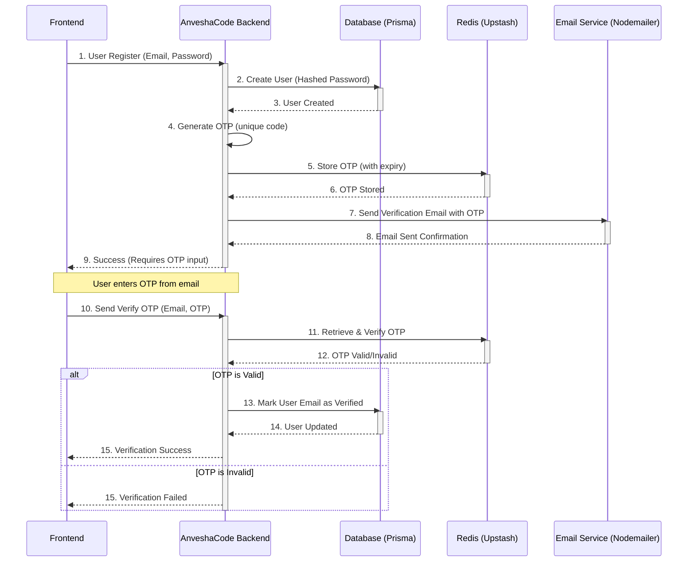

# Chapter 8: Email & OTP Communication

Welcome back to AnveshaCode! In our [last chapter: Frontend UI Component Library](07_frontend_ui_component_library_.md), we learned how AnveshaCode builds its beautiful and consistent user interface using reusable components. You saw how buttons, text fields, and pop-up messages appear and function on your screen.

### The Problem: Talking to Users Outside the App

AnveshaCode lives on the internet, but sometimes it needs to talk to you directly, outside of the website itself. Imagine you sign up, but we need to make sure it's *really* your email address. Or you forget your password and need to get back into your account. Or for an extra layer of security, we want to make sure it's you logging in, even if someone knows your password.

If AnveshaCode can't send you emails or temporary codes, these critical interactions become impossible or insecure. We need a reliable and secure way to communicate important, time-sensitive information.

### AnveshaCode's Solution: Secure Messages to Your Inbox

AnveshaCode solves this with a dedicated **Email & OTP Communication** system. This component handles sending automated emails for important actions and generating special "One-Time Passcodes" (OTPs) to verify your identity. Think of it like a secure postal service that delivers special, secret notes to your email inbox.

This system ensures that:
*   Your account is verified as truly yours.
*   You can securely reset your password if you forget it.
*   Your login is extra secure with two-factor authentication (2FA).

Let's look at a central use case:

**Use Case: Account Verification After Signup**
When a new user signs up for AnveshaCode, they enter their email address. To ensure the email is valid and belongs to them, AnveshaCode immediately sends a special "One-Time Passcode" (OTP) to that email. The user must then enter this OTP into the AnveshaCode website to activate their account.

### Key Concepts

Let's break down the main ideas behind AnveshaCode's Email & OTP Communication:

1.  **Email Service (Nodemailer):** This is the tool AnveshaCode uses to actually *send* emails. It connects to a mail provider (like Gmail or a dedicated email service) and handles the delivery of messages to your inbox. It's like our post office.

2.  **OTP (One-Time Passcode):** This is a unique, short numerical code (like `123456`) that is valid for only a very short time (e.g., 10 minutes) and can be used only *once*. It's a temporary secret key.
    *   **Email Verification:** Proves you own the email address.
    *   **Two-Factor Authentication (2FA):** An extra security step during login. After entering your password, you might need to enter an OTP sent to your email. This makes it much harder for someone to log in even if they steal your password.

3.  **Password Reset Link/Token:** If you forget your password, AnveshaCode sends an email with a special link. This link contains a secure, one-time-use "token" that allows you to set a new password without knowing the old one. This token is also a form of "one-time" secure communication.

4.  **Temporary Storage (Redis):** OTPs are very sensitive! They can't be stored permanently in our main database. Instead, they are stored in a super-fast, temporary storage system called **Redis** for a very short period (e.g., 10 minutes). Once used or expired, they are automatically deleted. This ensures security.

### How to Use Email & OTP Communication

From a user's perspective, you interact with this system when you sign up, log in, or use the "Forgot Password" feature.

#### 1. Signing Up and Verifying Email (Frontend)

After you fill out the signup form and click "Register", AnveshaCode sends an OTP to your email. The website then asks you to enter this code.

```typescript
// frontend/app/signup/page.tsx (simplified)
import { useState } from "react";
import { toast } from 'react-toastify'; // For displaying messages

export default function RegisterPage() {
  const [email, setEmail] = useState("");
  const [password, setPassword] = useState("");
  const [otpInput, setOtpInput] = useState("");
  const [showOtpVerification, setShowOtpVerification] = useState(false);
  const [isLoading, setIsLoading] = useState(false);

  const handleRegister = async () => {
    setIsLoading(true);
    try {
      // Calls backend API to register user and send OTP
      const response = await fetch('/api/auth/register', {
        method: 'POST',
        headers: { 'Content-Type': 'application/json' },
        body: JSON.stringify({ email, password }),
      });
      const data = await response.json();
      if (response.ok) {
        setShowOtpVerification(true); // Show OTP input if successful
        toast.success(data.message);
      } else {
        toast.error(data.message || 'Registration failed.');
      }
    } catch (error) { toast.error('An error occurred.'); }
    finally { setIsLoading(false); }
  };

  const handleVerifyOtp = async () => {
    setIsLoading(true);
    try {
      // Calls backend API to verify OTP
      const response = await fetch('/api/auth/verify-email', {
        method: 'POST',
        headers: { 'Content-Type': 'application/json' },
        body: JSON.stringify({ email, otp: otpInput }),
      });
      const data = await response.json();
      if (response.ok) {
        toast.success(data.message);
        // Redirect to login page
      } else {
        toast.error(data.message || 'OTP verification failed.');
      }
    } catch (error) { toast.error('An error occurred.'); }
    finally { setIsLoading(false); }
  };

  return (
    <div>
      {!showOtpVerification ? (
        <button onClick={handleRegister} disabled={isLoading}>Register</button>
      ) : (
        <div>
          <input type="text" value={otpInput} onChange={(e) => setOtpInput(e.target.value)} placeholder="Enter OTP" />
          <button onClick={handleVerifyOtp} disabled={isLoading}>Verify Email</button>
        </div>
      )}
    </div>
  );
}
```
This shows how the frontend interacts: first sending registration details, then (if successful) presenting an input field for the OTP received via email, and finally sending that OTP back for verification.

#### 2. Using "Forgot Password" (Frontend)

If you forget your password, you typically enter your email, and AnveshaCode sends a password reset link to it.

```typescript
// frontend/app/forgot-password/page.tsx (simplified)
import { useState } from "react";
import { toast } from 'react-toastify';

export default function ForgotPasswordPage() {
  const [email, setEmail] = useState("");
  const [isLoading, setIsLoading] = useState(false);

  const handleForgotPassword = async () => {
    setIsLoading(true);
    try {
      // Calls backend API to request password reset
      const response = await fetch('/api/auth/forgot-password', {
        method: 'POST',
        headers: { 'Content-Type': 'application/json' },
        body: JSON.stringify({ email }),
      });
      const data = await response.json();
      if (response.ok) {
        toast.success(data.message); // "Password reset instructions sent..."
      } else {
        toast.error(data.message || 'Failed to send reset email.');
      }
    } catch (error) { toast.error('An error occurred.'); }
    finally { setIsLoading(false); }
  };

  return (
    <div>
      <input type="email" value={email} onChange={(e) => setEmail(e.target.value)} placeholder="Your email" />
      <button onClick={handleForgotPassword} disabled={isLoading}>Send Reset Link</button>
    </div>
  );
}
```
Here, the frontend just needs to send the email to the backend. The backend handles generating the unique reset token and sending the email.

### Under the Hood: How Email & OTP Communication Works

Let's see how AnveshaCode's backend manages these email and OTP interactions.

#### 1. Signup and Email Verification Flow



Here's a closer look at the key backend pieces:

#### A. Generating and Storing OTPs (`backend/src/auth/utils/otp.ts` & `backend/src/utils/redis.ts`)

This is where the magic of creating and securely holding onto OTPs happens.

```typescript
// backend/src/utils/redis.ts (simplified)
import { Redis } from '@upstash/redis';

// Connect to our super-fast temporary storage
const redisClient = new Redis({
  url: process.env.UPSTASH_REDIS_REST_URL,
  token: process.env.UPSTASH_REDIS_REST_TOKEN,
});

export default redisClient;
```
This sets up our connection to `Upstash Redis`, which is a cloud-based Redis service. Environment variables are used for secure credentials.

```typescript
// backend/src/auth/utils/otp.ts (simplified generateOTP & storeOTP)
import crypto from 'crypto'; // For secure OTP generation
import redisClient from '../../utils/redis'; // Our Redis connection
import { PrismaClient } from '@prisma/client';

const prisma = new PrismaClient(); // To get user's 2FA secret from DB

const OTP_EXPIRY_MINUTES = 10;

// Generates a unique, time-based OTP for the user's email
export const generateOTP = async (email: string): Promise<string> => {
  const user = await prisma.user.findUnique({
    where: { email },
    select: { twoFactorSecret: true }
  });
  // If user has a 2FA secret, use it for a more secure OTP (TOTP-like)
  if (user?.twoFactorSecret) { /* ... crypto logic ... */ }
  // Otherwise, fallback to a simpler random OTP
  return Math.floor(100000 + Math.random() * 900000).toString();
};

// Stores the generated OTP in Redis with an expiration time
export const storeOTP = async (email: string, otp: string): Promise<void> => {
  const key = `otp:${email}`;
  // Store OTP data in Redis
  await redisClient.set(key, JSON.stringify({ otp, expiryTime: new Date(Date.now() + OTP_EXPIRY_MINUTES * 60 * 1000).toISOString() }));
  // Set the key to automatically disappear after OTP_EXPIRY_MINUTES
  await redisClient.expire(key, OTP_EXPIRY_MINUTES * 60);
};

// Verifies if the provided OTP matches the one stored in Redis and is not expired
export const verifyOTP = async (email: string, providedOTP: string): Promise<boolean> => {
  const key = `otp:${email}`;
  const storedData = await redisClient.get<string>(key);
  if (!storedData) return false; // No OTP stored or already expired/used

  const { otp, expiryTime } = JSON.parse(storedData);
  if (new Date(expiryTime) < new Date()) { // Check if expired
    await redisClient.del(key); // Clear expired OTP
    return false;
  }
  if (otp !== providedOTP) return false; // Check if codes match

  await redisClient.del(key); // OTP is valid and used, delete it
  return true;
};
```
This file contains the logic for:
*   `generateOTP`: Creating the unique code. It tries to use a more secure, time-based method if the user has a 2FA secret (from [Chapter 2: User Authentication & Authorization](02_user_authentication___authorization_.md)); otherwise, it falls back to a random 6-digit number.
*   `storeOTP`: Saving the OTP securely in Redis. Crucially, it sets an expiration time, so the OTP automatically disappears.
*   `verifyOTP`: Checking if the OTP provided by the user is correct, hasn't expired, and is then immediately deleted to ensure it's "one-time" use.

#### B. Sending Emails (`backend/src/auth/utils/email.ts`)

This utility handles the actual sending of emails.

```typescript
// backend/src/auth/utils/email.ts (simplified sendVerificationEmail)
import nodemailer from 'nodemailer'; // The library for sending emails

// Setup our email sending tool (transporter)
const transporter = nodemailer.createTransport({
  host: process.env.SMTP_HOST,      // Email server address
  port: parseInt(process.env.SMTP_PORT || '587'), // Port for email server
  secure: process.env.SMTP_SECURE === 'true', // Use secure connection (SSL/TLS)
  auth: {
    user: process.env.SMTP_USER, // Our email account for sending
    pass: process.env.SMTP_PASS, // Password for our email account
  },
});

// Sends a customized email (verification, login OTP, or password reset)
export const sendVerificationEmail = async (
  email: string,
  codeOrToken: string, // This could be an OTP or a reset token
  firstName: string,
  isLogin: boolean = false,
  isPasswordReset: boolean = false
): Promise<void> => {
  let subject: string;
  let htmlContent: string;

  if (isPasswordReset) {
    subject = 'Reset Your Password';
    htmlContent = `
      <p>Hello ${firstName},</p>
      <p>Click to reset: <a href="${process.env.FRONTEND_URL}/reset-password?token=${codeOrToken}">Reset Password</a></p>
    `;
  } else if (isLogin) {
    subject = 'Login Verification Code';
    htmlContent = `<p>Your login code: <strong>${codeOrToken}</strong></p>`;
  } else {
    subject = 'Verify Your Email Address';
    htmlContent = `<p>Your verification code: <strong>${codeOrToken}</strong></p>`;
  }

  const mailOptions = {
    from: `"AnveshaCode" <${process.env.SMTP_USER}>`,
    to: email,
    subject,
    html: htmlContent,
  };

  try {
    await transporter.sendMail(mailOptions); // Send the email!
  } catch (error) {
    console.error('Error sending email:', error);
    throw new Error('Failed to send email');
  }
};
```
This `sendVerificationEmail` function is flexible: it can send different types of emails (account verification, 2FA login, password reset) with customized subjects and content, all while using environment variables to connect to our chosen email service.

#### C. Orchestration in Auth Controller (`backend/src/auth/controller/auth-controller.ts`)

The `auth-controller.ts` acts as the conductor, bringing together the OTP generation, storage, verification, and email sending.

```typescript
// backend/src/auth/controller/auth-controller.ts (simplified register, verifyEmail, login)
import { Request, Response } from 'express';
import { sendVerificationEmail } from '../utils/email'; // For sending emails
import { generateOTP, storeOTP, verifyOTP } from '../utils/otp'; // For OTP logic
import { generateToken } from '../utils/jwt'; // For password reset tokens (Chapter 2)
import { findUserByEmail, updateUser, createUser } from '../db/user'; // For user DB ops (Chapter 3)

export const register = async (req: Request, res: Response): Promise<void> => {
  const { firstName, email, password } = req.body;
  // ... hash password, create user in DB (Chapter 3) ...

  const otp = await generateOTP(email); // Generate OTP
  await storeOTP(email, otp); // Store OTP
  await sendVerificationEmail(email, otp, firstName); // Send email
  res.status(201).json({ message: 'User registered... OTP sent.', userId: '...' });
};

export const verifyEmail = async (req: Request, res: Response): Promise<void> => {
  const { email, otp } = req.body;
  const isValid = await verifyOTP(email, otp); // Verify OTP
  if (!isValid) {
    res.status(400).json({ message: 'Invalid or expired OTP' });
    return;
  }
  await updateUser(email, { emailVerified: new Date() }); // Mark email as verified in DB
  res.status(200).json({ message: 'Email verified successfully' });
};

export const login = async (req: Request, res: Response): Promise<void> => {
  const { email, password } = req.body;
  const user = await findUserByEmail(email);
  // ... check password, email verified status ...

  const otp = await generateOTP(email); // Generate OTP for 2FA
  await storeOTP(email, otp); // Store
  await sendVerificationEmail(email, otp, user!.firstName, true); // Send 2FA email
  res.status(200).json({ message: 'OTP sent for 2FA', requiresOTP: true });
};

export const forgotPassword = async (req: Request, res: Response): Promise<void> => {
  const { email } = req.body;
  const user = await findUserByEmail(email);
  if (!user) { res.status(400).json({ message: 'User not found' }); return; }

  // Generate a JWT token as the reset token (Chapter 2)
  const resetToken = generateToken({ id: user.id, email: user.email }, '1h');
  await sendVerificationEmail(email, resetToken, user.firstName, false, true); // Send reset email
  res.status(200).json({ message: 'Password reset instructions sent.' });
};

export const resetPassword = async (req: Request, res: Response): Promise<void> => {
  const { token, newPassword } = req.body;
  const decoded = verifyToken(token); // Verify the reset token
  if (!decoded) { res.status(400).json({ message: 'Invalid or expired token' }); return; }
  
  // ... hash new password ...
  await updateUser(decoded.email, { password: '...' }); // Update password in DB
  res.status(200).json({ message: 'Password reset successful.' });
};
```
These functions in the `auth-controller.ts` define how the API layer (from [Chapter 6: Backend API Layer](06_backend_api_layer_.md)) orchestrates the email and OTP processes. For `register` and `login`, they call `generateOTP`, `storeOTP`, and `sendVerificationEmail`. For `verifyEmail`, they call `verifyOTP` and then update the user's status in the database (using [Chapter 3: Database Management with Prisma](03_database_management_with_prisma_.md)). For `forgotPassword` and `resetPassword`, they generate/verify a JWT token and use `sendVerificationEmail` to send the link.

### Conclusion

In this chapter, we've explored **Email & OTP Communication**. We learned that this system is crucial for securely interacting with users outside the main application. We saw how AnveshaCode sends automated emails using `nodemailer`, generates and manages one-time passcodes (OTPs) with `crypto` and `Redis`, and how these are used for critical actions like account verification, two-factor authentication (2FA), and password resets. This reliable and secure communication channel is vital for maintaining user trust and account security in AnveshaCode.

Next, we'll dive into how AnveshaCode collects and uses data to understand user behavior and application performance in [Chapter 9: Analytics & Reporting](09_analytics___reporting_.md).

---
