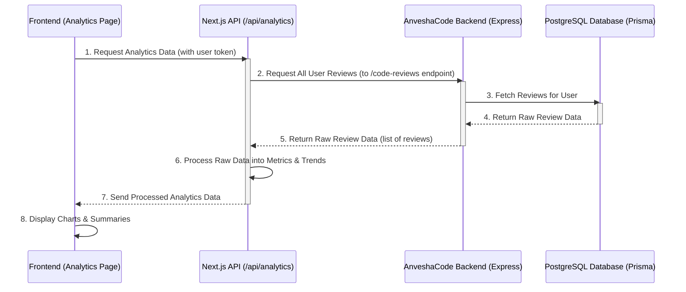

# Chapter 9: Analytics & Reporting

Welcome back to AnveshaCode! In our [last chapter: Email & OTP Communication](08_email___otp_communication_.md), we learned how AnveshaCode securely talks to you outside the application, sending important messages like verification codes and password reset links. You saw how crucial these communications are for account security and user trust.

### The Problem: Making Sense of Your Code Review Journey

You've been using AnveshaCode to review your code, getting scores and feedback (from [Chapter 1: AI Code Review Core](01_ai_code_review_core_.md)). That's great for individual files! But imagine you've reviewed dozens, or even hundreds, of code snippets over time. How do you know if your code quality is improving? What programming languages do you use the most? What types of issues (security, performance, best practices) appear most frequently in your code?

Looking at individual review results won't tell you these big-picture trends. Raw data, like a long list of all your code reviews, isn't very helpful on its own. It's like having a stack of all your test scores but no report card showing your overall progress or areas for improvement.

### AnveshaCode's Solution: Your Personal Code Improvement Dashboard

AnveshaCode solves this by providing **Analytics & Reporting**. This system acts like a smart data scientist working behind the scenes. It collects all your past code review data, crunches the numbers, and turns that raw information into easy-to-understand charts and summaries.

It's like getting a personalized report card for your coding journey! You can see your total reviews, common issues, language preferences, and even how your code quality changes over time. This helps you track your progress, identify weaknesses, and become a better developer.

Let's look at a central use case:

**Use Case: Viewing Your Code Review Dashboard**
A user wants to understand their overall code review activity. They navigate to the Analytics page and immediately see:
*   How many total reviews they've done.
*   The overall average issues per review.
*   A breakdown of which programming languages they review most often.
*   A chart showing their review activity over the last few months.

### Key Concepts

To understand Analytics & Reporting, let's break down its main components:

1.  **Data Collection:** The raw material for analytics is all your past code reviews, which are securely stored in our database (as we learned in [Chapter 3: Database Management with Prisma](03_database_management_with_prisma_.md)). Each review record contains valuable information like the score, the number of issues, the language, and when it was created.

2.  **Data Processing & Aggregation:** This is where the "data scientist" magic happens. Instead of just showing individual reviews, AnveshaCode's backend will:
    *   **Count:** Total reviews, total issues.
    *   **Calculate Averages:** Average issues per review.
    *   **Group:** Organize reviews by month (for trends), by programming language, by issue type, or by severity level.
    *   **Summarize:** Create overall metrics like "resolution rate" (though in our simplified example, we'll focus on review counts and issues).

3.  **Visualization:** After the numbers are crunched, the frontend (what you see) takes these summaries and displays them as appealing charts and graphs (like pie charts for language distribution or bar charts for monthly activity). This makes it super easy to grasp complex information at a glance.

4.  **Reporting & Export:** Sometimes, you might want to download your data for your own records or to share it. AnveshaCode allows you to export your analytics data in different formats (like JSON or CSV).

### How to Use Analytics & Reporting

From a user's perspective, you'll mainly interact with this system on the dedicated Analytics page.

#### 1. Viewing Your Analytics Dashboard (Frontend)

You'll navigate to a dedicated "Analytics" page. On this page, the frontend will fetch your personal review data and display it in various charts and summary cards.

```typescript
// frontend/app/analytics/page.tsx (simplified fetch & display)
"use client" // This component runs on the client side

import { useState, useEffect } from "react"
import useSWR from 'swr' // A helpful tool for fetching data
import { Card, CardHeader, CardTitle, CardContent } from "@/components/ui/card" // UI components from Chapter 7
import { ResponsiveContainer, AreaChart, Area, XAxis, YAxis, Tooltip } from "recharts" // For charts

// Function to fetch data from our API
const fetcher = (url: string, token: string) =>
  fetch(url, { headers: { 'Authorization': `Bearer ${token}` } })
    .then(res => {
      if (!res.ok) throw new Error('Failed to fetch analytics data');
      return res.json();
    });

export default function AnalyticsPage() {
  const token = typeof window !== 'undefined' ? localStorage.getItem('token') : null; // Get user token from Chapter 2

  // Use useSWR to fetch data, it handles loading and errors automatically
  const { data: analyticsData, error, isLoading } = useSWR(
    token ? ['/api/analytics', token] : null, // Only fetch if token exists
    ([url, token]) => fetcher(url, token)
  );

  if (isLoading) return <div className="text-center p-8">Loading your insights...</div>;
  if (error) return <div className="text-center p-8 text-red-500">Error: {error.message}</div>;
  if (!analyticsData) return <div className="text-center p-8">No analytics data yet. Review some code!</div>;

  return (
    <div className="space-y-6">
      <h2 className="text-2xl font-bold">Your Code Review Insights</h2>

      {/* Overview Cards */}
      <div className="grid gap-4 md:grid-cols-2 lg:grid-cols-4">
        <Card>
          <CardHeader><CardTitle className="text-sm">Total Reviews</CardTitle></CardHeader>
          <CardContent><div className="text-2xl font-bold">{analyticsData.overview.totalReviews}</div></CardContent>
        </Card>
        <Card>
          <CardHeader><CardTitle className="text-sm">Total Issues</CardTitle></CardHeader>
          <CardContent><div className="text-2xl font-bold">{analyticsData.overview.totalIssues}</div></CardContent>
        </Card>
        <Card>
          <CardHeader><CardTitle className="text-sm">Avg. Issues per Review</CardTitle></CardHeader>
          <CardContent><div className="text-2xl font-bold">{analyticsData.overview.averageIssuesPerReview.toFixed(1)}</div></CardContent>
        </Card>
      </div>

      {/* Monthly Review Activity Chart */}
      <Card>
        <CardHeader><CardTitle>Monthly Review Activity</CardTitle></CardHeader>
        <CardContent className="h-[300px]">
          <ResponsiveContainer width="100%" height="100%">
            <AreaChart data={analyticsData.monthlyData}>
              <XAxis dataKey="name" />
              <YAxis />
              <Tooltip />
              <Area type="monotone" dataKey="reviews" stroke="#8884d8" fill="#8884d8" fillOpacity={0.3} />
            </AreaChart>
          </ResponsiveContainer>
        </CardContent>
      </Card>

      {/* Language Distribution (simplified, actual UI uses PieChart) */}
      <Card>
        <CardHeader><CardTitle>Language Distribution</CardTitle></CardHeader>
        <CardContent>
          <ul className="list-disc pl-5">
            {analyticsData.languageData.map((lang: any) => (
              <li key={lang.name}>{lang.name}: {lang.value} reviews</li>
            ))}
          </ul>
        </CardContent>
      </Card>
    </div>
  )
}
```
This simplified code shows how the `AnalyticsPage` uses `useSWR` to fetch data from our `/api/analytics` endpoint. Once the `analyticsData` is received, it populates different `Card` components (from [Chapter 7: Frontend UI Component Library](07_frontend_ui_component_library_.md)) with summary numbers and feeds data into charting components like `AreaChart` to draw visual trends.

#### 2. Exporting Your Data (Frontend)

AnveshaCode also allows you to download your analytics data. This is typically done through a "Download" or "Export" button on the analytics page.

```typescript
// frontend/app/analytics/page.tsx (simplified exportData function)
// ... (imports and other code as above) ...

  const exportData = (format: 'json' | 'csv') => {
    if (!analyticsData) {
      console.error("No data to export!");
      return;
    }

    let blob: Blob;
    let filename: string;

    if (format === 'json') {
      const reportString = JSON.stringify(analyticsData, null, 2); // Format as pretty JSON
      blob = new Blob([reportString], { type: 'application/json' });
      filename = `anveshacode_analytics_${new Date().toISOString().split('T')[0]}.json`;
    } else { // CSV
      const csvRows = [];
      // Example: Add overview data
      csvRows.push('Metric,Value');
      Object.entries(analyticsData.overview).forEach(([key, value]) => {
        csvRows.push(`${key},${value}`);
      });
      // ... Add other data sections to CSV ...
      blob = new Blob([csvRows.join('\n')], { type: 'text/csv' });
      filename = `anveshacode_analytics_${new Date().toISOString().split('T')[0]}.csv`;
    }

    // Create a temporary link and click it to trigger download
    const url = window.URL.createObjectURL(blob);
    const link = document.createElement('a');
    link.href = url;
    link.download = filename;
    document.body.appendChild(link);
    link.click();
    document.body.removeChild(link);
    window.URL.revokeObjectURL(url); // Clean up the URL object

    console.log(`Analytics data exported as ${format.toUpperCase()}`);
  };

  return (
    <div>
      {/* ... (other JSX) ... */}
      <button onClick={() => exportData('json')}>Export as JSON</button>
      <button onClick={() => exportData('csv')}>Export as CSV</button>
    </div>
  );
}
```
This `exportData` function takes the `analyticsData` (which was already fetched from the backend) and converts it into either JSON or CSV format. It then creates a temporary download link to allow you to save the file to your computer.

### Under the Hood: How Analytics & Reporting Works

Let's peek behind the curtain to see how AnveshaCode's backend gathers and processes your code review data for analytics.



Here's a closer look at the key backend pieces:

#### 1. The Next.js API Endpoint for Analytics (`frontend/app/api/analytics/route.ts`)

This API route is what the frontend `AnalyticsPage` calls directly. Its job is to get the raw data from the main Express backend, then perform the calculations.

```typescript
// frontend/app/api/analytics/route.ts (simplified GET handler)
import { NextRequest, NextResponse } from 'next/server';
import { authApi } from '@/lib/auth'; // Helper for authentication (from Chapter 2)

export async function GET(request: NextRequest) {
  try {
    const token = request.headers.get('authorization')?.split(' ')[1]; // Get user's token

    if (!token) {
      return NextResponse.json({ error: 'Unauthorized' }, { status: 401 });
    }

    // Authenticate user via authApi to ensure valid session (from Chapter 2)
    const profileResponse = await authApi.getUserProfile(token);
    if (!profileResponse.user) {
      return NextResponse.json({ error: 'Unauthorized' }, { status: 401 });
    }

    // 1. Fetch all code reviews for this user from the main Express backend
    const response = await fetch(`${process.env.NEXT_PUBLIC_API_URL}/code-reviews`, {
      headers: { 'Authorization': `Bearer ${token}` } // Send user token for authorization (Chapter 6)
    });

    if (!response.ok) {
      throw new Error('Failed to fetch code reviews from backend');
    }

    const reviews = await response.json(); // Get the list of all reviews

    // 2. Perform Data Processing & Aggregation
    const totalReviews = reviews.length;
    const totalIssues = reviews.reduce((acc: number, review: any) => acc + review.issuesCount, 0);
    const averageIssuesPerReview = totalReviews > 0 ? totalIssues / totalReviews : 0;

    const monthlyData = reviews.reduce((acc: any[], review: any) => {
      const month = new Date(review.createdAt).toLocaleString('default', { month: 'short', year: 'numeric' });
      let existingMonth = acc.find(m => m.name === month);
      if (!existingMonth) {
        existingMonth = { name: month, reviews: 0, issues: 0 };
        acc.push(existingMonth);
      }
      existingMonth.reviews++;
      existingMonth.issues += review.issuesCount;
      return acc;
    }, []).sort((a: any, b: any) => new Date(a.name) as any - (new Date(b.name) as any)); // Sort by date

    const languageData = reviews.reduce((acc: any[], review: any) => {
      const language = review.language || 'Unknown';
      let existingLang = acc.find(l => l.name === language);
      if (!existingLang) {
        existingLang = { name: language, value: 0 };
        acc.push(existingLang);
      }
      existingLang.value++;
      return acc;
    }, []).sort((a: any, b: any) => b.value - a.value); // Sort by count

    // ... (similar logic for issueTypeData, severityData from the full code) ...

    return NextResponse.json({ // Send back the processed data
      overview: { totalReviews, totalIssues, averageIssuesPerReview /* ... */ },
      monthlyData,
      languageData,
      // ... other aggregated data ...
    });
  } catch (error) {
    console.error('Error fetching analytics data:', error);
    return NextResponse.json(
      { error: 'Failed to fetch analytics data' },
      { status: 500 }
    );
  }
}
```
This Next.js API route (`/api/analytics`):
1.  Receives the request from the frontend and extracts the user's `token` (from [Chapter 2: User Authentication & Authorization](02_user_authentication___authorization_.md)).
2.  It then makes another request to our main **Express backend's** `/code-reviews` endpoint. This Express endpoint (as we learned in [Chapter 6: Backend API Layer](06_backend_api_layer_.md)) is responsible for fetching all `CodeReview` records for the authenticated user directly from the database (using Prisma, from [Chapter 3: Database Management with Prisma](03_database_management_with_prisma_.md)).
3.  Once it gets the raw `reviews` array from the Express backend, this Next.js API route takes over. It uses JavaScript's `reduce` method (like a powerful counting and grouping tool) to calculate `totalReviews`, `totalIssues`, `averageIssuesPerReview`, and to build `monthlyData` and `languageData` arrays.
4.  Finally, it sends this neatly packaged and processed `analyticsData` back to the frontend to be displayed.

#### 2. The Express Backend's Role: Providing Raw Review Data (`backend/src/app/routes/code-review-routes.ts`)

For the Next.js API route to get all reviews, the main Express backend needs an endpoint that provides this raw data. While we showed a `POST` route for creating reviews in [Chapter 6: Backend API Layer](06_backend_api_layer_.md), here's how a `GET` route for retrieving *all* reviews might look:

```typescript
// backend/src/app/routes/code-review-routes.ts (simplified GET / route)
import express, { Request, Response } from 'express';
import { authenticate } from '../../auth/middleware/auth.middleware'; // Our security middleware (Chapter 2 & 6)
import { PrismaClient } from '@prisma/client'; // Our database connection (Chapter 3)

const router = express.Router();
const prisma = new PrismaClient(); // Connect to the database

// We need to extend the Request type to include `user`
interface AuthenticatedRequest extends Request {
  user?: { id: string; email: string };
}

// Route to get all code reviews for the authenticated user
router.get('/', authenticate, async (req: AuthenticatedRequest, res: Response): Promise<Response> => {
  try {
    if (!req.user) {
      // This should ideally be caught by 'authenticate' middleware, but good to double-check
      return res.status(401).json({ message: 'User not authenticated' });
    }
    const userId = req.user.id; // Get the user's ID from the authenticated request

    // Fetch all code reviews from the database for this specific user
    const reviews = await prisma.codeReview.findMany({
      where: { userId }, // Only fetch reviews belonging to this user
      orderBy: { createdAt: 'desc' }, // Order them by newest first
      select: { // Select all fields needed for analytics
        id: true,
        fileName: true,
        code: true, // You might send full code or just a snippet for analytics
        review: true,
        score: true,
        issuesCount: true,
        status: true,
        createdAt: true,
        language: true,
        // Assuming AI also provides these as JSON fields in DB:
        issueTypes: true, // e.g., { "Security": 5, "Performance": 2 }
        severity: true,   // e.g., { "High": 1, "Medium": 3 }
      }
    });

    return res.status(200).json(reviews); // Send the raw list of reviews back
  } catch (error) {
    console.error('Error fetching code reviews:', error);
    return res.status(500).json({ message: 'Error fetching code reviews' });
  }
});

export default router;
```
This `GET /` route in the Express backend is crucial.
1.  It first uses the `authenticate` middleware (from [Chapter 6: Backend API Layer](06_backend_api_layer_.md)) to ensure only logged-in users can request their reviews.
2.  It then uses `prisma.codeReview.findMany` (from [Chapter 3: Database Management with Prisma](03_database_management_with_prisma_.md)) to retrieve *all* code reviews linked to that specific `userId`.
3.  The `select` statement ensures that all relevant fields like `score`, `issuesCount`, `language`, `createdAt`, and also `issueTypes` and `severity` (which are typically JSON-like fields generated by the AI review and stored in the database) are fetched.
4.  Finally, it sends this raw list of review objects back to the requesting Next.js API route.

By chaining these requests, AnveshaCode efficiently fetches the data, processes it into meaningful insights, and presents it to you in an easy-to-understand dashboard.

### Conclusion

In this chapter, we've explored **Analytics & Reporting**. We learned how AnveshaCode transforms your raw code review data into insightful metrics and trends, helping you track your progress as a developer. We saw how data is collected from your stored code reviews, processed into summaries and trends (like total reviews, average issues, and monthly activity), and then beautifully visualized on the frontend. This system empowers you with a clear understanding of your coding habits and improvements over time.

Now that we've covered how AnveshaCode provides insights, let's dive into some useful tools and common patterns used on the frontend to make development smoother and more efficient in [Chapter 10: Frontend Utilities & Hooks](10_frontend_utilities___hooks_.md).

[Next Chapter: Frontend Utilities & Hooks](10_frontend_utilities___hooks_.md)

---
