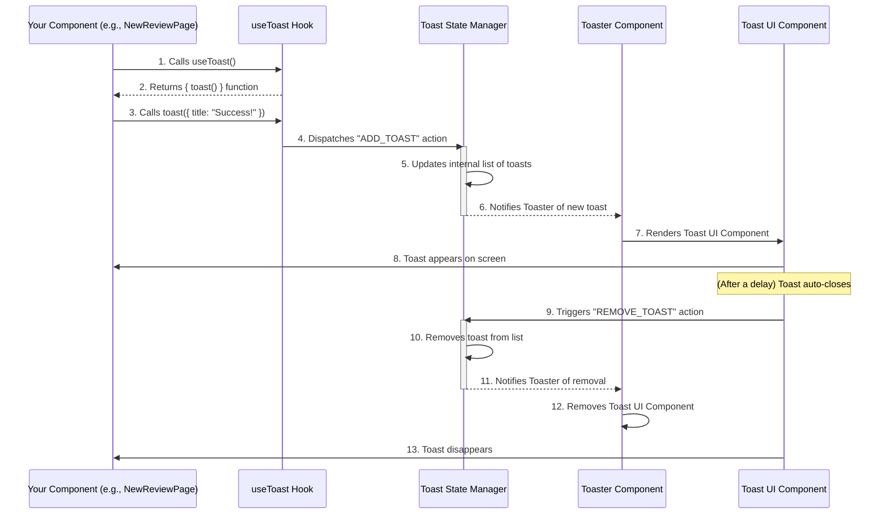

# Chapter 10: Frontend Utilities & Hooks

Welcome back to AnveshaCode! In our [last chapter: Analytics & Reporting](09_analytics___reporting_.md), we learned how AnveshaCode crunches your code review data to give you valuable insights into your coding habits and progress. You saw how raw information is transformed into clear charts and summaries.

### The Problem: Small Tasks, Big Repetition

As we build a complex application like AnveshaCode, developers often face many small, recurring tasks on the frontend (the part you see and interact with).
*   Imagine you have a button that usually has a blue background, but sometimes it needs to be red if there's an error. How do you easily combine these styles?
*   How do you know if a user is browsing on a small phone screen versus a large desktop monitor, so you can adjust the layout?
*   And how do you show those quick, temporary messages like "Saved successfully!" or "Login failed!" that pop up and disappear?

If we had to write custom code for each of these small, common tasks every single time, it would make development slow, lead to inconsistent designs, and introduce many chances for mistakes. It's like having to invent a new way to open a bottle every time you want a drink instead of just using a bottle opener!

### AnveshaCode's Solution: Your Frontend Developer's Handy Toolkit

AnveshaCode solves these common problems using **Frontend Utilities & Hooks**. Think of this as the developer's "handy toolkit" or "Swiss Army Knife" for building the user interface. It's a collection of small, specialized helper functions (utilities) and custom React hooks that provide ready-to-use solutions for common frontend challenges.

This toolkit helps us:
*   Write less repetitive code.
*   Ensure a consistent look and feel across the application.
*   Make the user experience smoother and more responsive.

Let's look at a central use case:

**Use Case: Displaying a Quick Success Notification**
After you submit your code for review in AnveshaCode (as we saw in [Chapter 1: AI Code Review Core](01_ai_code_review_core_.md)), you want a quick message to pop up saying "Code reviewed successfully!" and then disappear automatically. This is a perfect job for a "toast" notification.

### Key Concepts

Let's break down the main ideas behind Frontend Utilities & Hooks:

1.  **Utilities:** These are simple helper functions that perform a specific task, often related to data manipulation or conditional logic. They help keep your code clean and readable.
    *   **`cn` (Class Name Utility):** A common utility in modern React apps. It helps you combine multiple CSS class names together, especially when some classes are conditional (e.g., "add this red color class *only if* there's an error"). It smartly handles duplicates and `undefined` values.

2.  **Hooks (Custom React Hooks):** In React, "hooks" are special functions that let you "hook into" React features (like `useState` for managing data or `useEffect` for side effects). **Custom hooks** are even more powerful: they let you extract and reuse complex logic across different parts of your application.
    *   **`useToast`:** Our custom hook for displaying those small, transient pop-up notifications (toasts). It provides a simple way to show messages like "Success!" or "Error!".
    *   **`useIsMobile`:** Our custom hook that tells you whether the user is currently viewing the application on a mobile device (like a phone or tablet) or a desktop computer. This helps us make the user interface look good on different screen sizes.

### How to Use Frontend Utilities & Hooks

From a developer's perspective, using these utilities and hooks is very straightforward. You import them into your React components and then use them like regular functions or other React hooks.

Let's look at examples for our central use case and other common scenarios:

#### 1. Displaying a Toast Notification (`useToast`)

In [Chapter 7: Frontend UI Component Library](07_frontend_ui_component_library_.md), we briefly saw `useToast`. Let's see it in action after a successful code review submission:

```typescript
// frontend/app/new-review/page.tsx (simplified)
import { useState } from "react"
import { Button } from "@/components/ui/button"
import { Textarea } from "@/components/ui/textarea"
import { useToast } from "@/hooks/use-toast" // Our toast hook!

export default function NewReviewPage() {
  const [pastedCode, setPastedCode] = useState("")
  const [isLoading, setIsLoading] = useState(false)
  const { toast } = useToast() // Get the 'toast' function from the hook

  const handlePasteReview = async () => {
    if (!pastedCode.trim()) {
      toast({ // Show a warning toast
        title: "No code!",
        description: "Please paste code to review.",
        variant: "destructive", // Make it red for errors
      });
      return;
    }

    setIsLoading(true);
    try {
      // Calls backend API for review (covered in Chapter 1 & 6)
      const response = await fetch('/api/review', { /* ... */ });
      const data = await response.json();

      if (!response.ok) {
        toast({ // Show error toast from backend message
          title: "Review Failed",
          description: data.message || "An unknown error.",
          variant: "destructive",
        });
        return;
      }

      toast({ // Show a success toast!
        title: "Code Reviewed!",
        description: `Your score: ${data.score}/100.`,
      });

    } catch (error) {
      toast({ title: "Network Error", description: "Check connection.", variant: "destructive" });
    } finally {
      setIsLoading(false);
    }
  };

  return (
    <div>
      <Textarea value={pastedCode} onChange={(e) => setPastedCode(e.target.value)} />
      <Button onClick={handlePasteReview} disabled={isLoading}>
        {isLoading ? "Analyzing..." : "Review Code"}
      </Button>
    </div>
  );
}
```
In this example, calling `toast({ ... })` from the `useToast` hook makes a small notification pop up at the corner of the screen, providing immediate feedback to the user. This is much simpler than manually managing notification states in every component.

#### 2. Conditionally Merging CSS Classes (`cn`)

The `cn` utility is used very frequently with Tailwind CSS (which we learned about in [Chapter 7: Frontend UI Component Library](07_frontend_ui_component_library_.md)). It helps you combine CSS classes intelligently.

```typescript
// frontend/components/SomeButton.tsx (simplified)
import { cn } from "@/lib/utils"; // Our class name utility

interface SomeButtonProps {
  isActive?: boolean;
}

export function SomeButton({ isActive }: SomeButtonProps) {
  const baseClasses = "py-2 px-4 rounded-md font-semibold";
  const activeClasses = isActive ? "bg-blue-500 text-white" : "bg-gray-200 text-gray-800";

  return (
    <button className={cn(baseClasses, activeClasses, "hover:opacity-80")}>
      Click Me
    </button>
  );
}
// Usage: <SomeButton isActive={true} /> or <SomeButton isActive={false} />
```
Here, `cn` combines `baseClasses`, `activeClasses` (which changes based on `isActive`), and an always-present `hover` class. If `isActive` is `true`, `cn` effectively creates `"py-2 px-4 rounded-md font-semibold bg-blue-500 text-white hover:opacity-80"`. If `false`, it creates `"py-2 px-4 rounded-md font-semibold bg-gray-200 text-gray-800 hover:opacity-80"`. It handles overlapping classes gracefully (e.g., if you gave it `"p-4", "p-2"`, it would correctly use `"p-2"`).

#### 3. Detecting Mobile Devices (`useIsMobile`)

The `useIsMobile` hook helps you adapt your UI for different screen sizes.

```typescript
// frontend/app/dashboard/page.tsx (simplified)
import { useIsMobile } from "@/hooks/use-mobile"; // Our mobile detection hook

export default function DashboardLayout() {
  const isMobile = useIsMobile(); // Check if on mobile

  return (
    <div className="p-4">
      <h1 className="text-2xl font-bold">Your Dashboard</h1>

      {isMobile ? (
        <div className="mt-4 p-3 bg-blue-100 rounded">
          <p>Welcome! Optimized for mobile viewing.</p>
          {/* Mobile-specific content or layout */}
          <button className="mt-2 p-2 bg-blue-500 text-white rounded">
            Mobile Action
          </button>
        </div>
      ) : (
        <div className="mt-4 p-5 bg-green-100 rounded">
          <p>Welcome! Enjoy the full desktop experience.</p>
          {/* Desktop-specific content or layout */}
          <button className="mt-2 p-3 bg-green-500 text-white rounded">
            Desktop Action
          </button>
        </div>
      )}
    </div>
  );
}
```
This example shows how `useIsMobile()` returns `true` or `false`, allowing the component to render different content or apply different styles based on the screen size. This helps create a responsive user interface.

### Under the Hood: How the Toolkit Works

Let's peek behind the curtain to understand how these handy tools are implemented.

#### 1. The `useToast` Hook and Toast System

The `useToast` hook is part of a larger system that allows "toast" notifications to appear.



Here's a closer look at the key parts of the toast system:

**A. The `useToast` Hook (`frontend/hooks/use-toast.ts`):**
This file defines the `useToast` hook. It manages a list of active toasts using a central "state manager" (a simplified Redux-like pattern called `reducer` and `dispatch`).

```typescript
// frontend/hooks/use-toast.ts (simplified)
"use client"
import * as React from "react"

// A simplified version of a React Reducer to manage toasts
const reducer = (state: any, action: any): any => {
  switch (action.type) {
    case "ADD_TOAST":
      // Add new toast, limit to 1 active toast at a time
      return { ...state, toasts: [action.toast, ...state.toasts].slice(0, 1) };
    case "REMOVE_TOAST":
      // Filter out the toast to be removed
      return { ...state, toasts: state.toasts.filter((t: any) => t.id !== action.toastId) };
    default: return state;
  }
}

let memoryState: any = { toasts: [] } // Where toasts are stored temporarily
const listeners: Array<(state: any) => void> = [] // Who needs to be updated

function dispatch(action: any) {
  memoryState = reducer(memoryState, action); // Update state
  listeners.forEach((listener) => listener(memoryState)); // Tell everyone to update
}

// The main function returned by useToast to add a new toast
function toast({ ...props }: any) {
  const id = Math.random().toString(); // Simple ID for the toast
  dispatch({
    type: "ADD_TOAST",
    toast: { ...props, id, open: true, onOpenChange: (open: boolean) => !open && dispatch({ type: "REMOVE_TOAST", toastId: id }) },
  });
  return { id };
}

// The actual React Hook that components use
function useToast() {
  const [state, setState] = React.useState<any>(memoryState); // Get current toasts

  React.useEffect(() => {
    listeners.push(setState); // Listen for changes to toasts
    return () => {
      const index = listeners.indexOf(setState);
      if (index > -1) listeners.splice(index, 1); // Clean up listener
    };
  }, [state]);

  return { ...state, toast }; // Return toast data and the function to show toasts
}

export { useToast, toast };
```
This hook provides the `toast` function, which dispatches an `ADD_TOAST` action. This action updates `memoryState` (a global list of toasts) and notifies any components "listening" for changes.

**B. The `Toaster` Component (`frontend/components/ui/toaster.tsx`):**
This component is usually placed once in the main application layout (`frontend/app/layout.tsx`). Its job is to "listen" to the `useToast` hook and render the actual `Toast` UI components for each toast in the `toasts` list.

```typescript
// frontend/components/ui/toaster.tsx (simplified)
"use client"
import { useToast } from "@/hooks/use-toast"
import {
  Toast, ToastClose, ToastDescription, ToastProvider, ToastTitle, ToastViewport,
} from "@/components/ui/toast" // Individual toast components from Chapter 7

export function Toaster() {
  const { toasts } = useToast() // Get the list of active toasts

  return (
    <ToastProvider>
      {toasts.map(function ({ id, title, description, action, ...props }) {
        return (
          // Render each individual Toast component
          <Toast key={id} {...props}>
            <div className="grid gap-1">
              {title && <ToastTitle>{title}</ToastTitle>}
              {description && <ToastDescription>{description}</ToastDescription>}
            </div>
            {action}
            <ToastClose />
          </Toast>
        )
      })}
      <ToastViewport /> {/* Position where toasts appear */}
    </ToastProvider>
  )
}
```
The `Toaster` component iterates over the `toasts` array provided by `useToast` and renders a `Toast` component for each. The `Toast` components themselves are built using `Radix UI Primitives` and `Tailwind CSS`, as explained in [Chapter 7: Frontend UI Component Library](07_frontend_ui_component_library_.md).

#### 2. The `cn` Utility (`frontend/lib/utils.ts`)

This is a very small but powerful utility. It leverages two external libraries:
*   `clsx`: For easily constructing class name strings from various inputs (strings, objects, arrays, booleans).
*   `tailwind-merge`: For intelligently merging Tailwind CSS classes, resolving conflicts where specific utility classes override more general ones (e.g., `p-4` would override `p-2`).

```typescript
// frontend/lib/utils.ts
import { clsx, type ClassValue } from "clsx"
import { twMerge } from "tailwind-merge"

// This function takes multiple class names and merges them intelligently.
// For example, cn("p-4", "p-2") will result in "p-2" (last one wins).
export function cn(...inputs: ClassValue[]) {
  return twMerge(clsx(inputs))
}
```
This function is concise because the heavy lifting is done by the `clsx` and `tailwind-merge` libraries. It's simply a wrapper to combine their powers.

#### 3. The `useIsMobile` Hook (`frontend/hooks/use-mobile.tsx`)

This hook uses standard browser features to detect screen width changes.

```typescript
// frontend/hooks/use-mobile.tsx (simplified)
import * as React from "react"

const MOBILE_BREAKPOINT = 768; // Screens smaller than this are considered mobile (in pixels)

export function useIsMobile() {
  // State to hold whether it's mobile or not, starts as undefined
  const [isMobile, setIsMobile] = React.useState<boolean | undefined>(undefined);

  React.useEffect(() => {
    // Media query listens for screen width changes
    const mql = window.matchMedia(`(max-width: ${MOBILE_BREAKPOINT - 1}px)`);

    // Function to update the state based on current screen width
    const onChange = () => {
      setIsMobile(window.innerWidth < MOBILE_BREAKPOINT);
    }

    // Add listener for changes and set initial value
    mql.addEventListener("change", onChange);
    onChange(); // Set initial value immediately

    // Clean up listener when component unmounts
    return () => mql.removeEventListener("change", onChange);
  }, []); // Empty dependency array means this effect runs once on mount

  // Return true or false (!! converts undefined to false)
  return !!isMobile;
}
```
This hook uses `useEffect` to set up a `window.matchMedia` listener. This listener triggers the `onChange` function whenever the browser window's width crosses the `MOBILE_BREAKPOINT`. The `onChange` function then updates the `isMobile` state, which causes any component using `useIsMobile` to re-render with the correct mobile status.

### Conclusion

In this final chapter, we've explored **Frontend Utilities & Hooks**. We learned that these are like a developer's handy toolkit, providing reusable helper functions (like `cn` for managing CSS classes) and custom React hooks (like `useToast` for notifications and `useIsMobile` for responsive design). These abstractions are crucial for building the AnveshaCode frontend efficiently, consistently, and with a great user experience. They enable developers to focus on unique application logic rather than reinventing common UI patterns.

This concludes our tutorial on the core abstractions of AnveshaCode. We've journeyed from the AI's brain to user accounts, database management, payments, limits, APIs, UI components, communications, and analytics. You now have a foundational understanding of how a complex application like AnveshaCode is built, layer by layer, to provide a powerful and seamless code review experience!

---