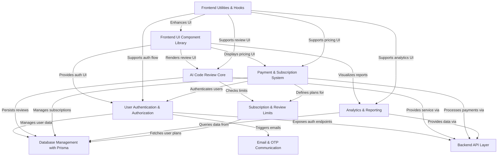

# Tutorial: AnveshaCode

AnveshaCode is an **AI-powered platform** providing *automated code reviews*. It enables users to submit code, receive detailed analysis, quality scores, and identified issues. The project features a comprehensive **user authentication and authorization system**, a robust **payment and subscription management** with Stripe integration, and in-depth **analytics** to track review activity. Its core purpose is to help developers improve their code quality and understand their coding habits effectively.

## Visual Overview

## Chapters

1. [AI Code Review Core
](01_ai_code_review_core_.md)
2. [User Authentication & Authorization
](02_user_authentication___authorization_.md)
3. [Database Management with Prisma
](03_database_management_with_prisma_.md)
4. [Payment & Subscription System
](04_payment___subscription_system_.md)
5. [Subscription & Review Limits
](05_subscription___review_limits_.md)
6. [Backend API Layer
](06_backend_api_layer_.md)
7. [Frontend UI Component Library
](07_frontend_ui_component_library_.md)
8. [Email & OTP Communication
](08_email___otp_communication_.md)
9. [Analytics & Reporting
](09_analytics___reporting_.md)
10. [Frontend Utilities & Hooks
](10_frontend_utilities___hooks_.md)

---